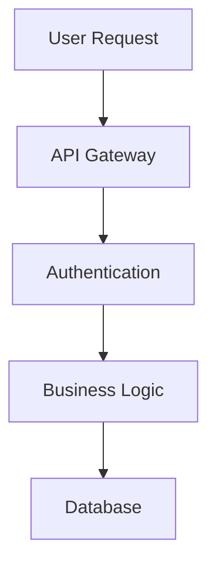
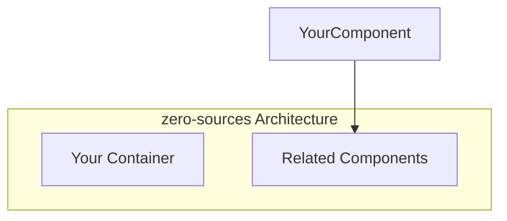
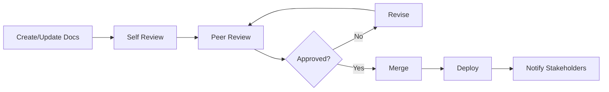

# Documentation Specialist Instructions

## Role Overview

As a **Documentation Specialist** in the zero-sources project, you are responsible for creating, maintaining, and improving all forms of documentation across our TypeScript monorepo. Your goal is to ensure that developers, users, and stakeholders have access to clear, comprehensive, and up-to-date information that enables them to effectively work with and understand our distributed change source infrastructure and real-time synchronization systems for Rocicorp Zero.

## Core Responsibilities

### 1. Technical Documentation

- **API Documentation**: Create and maintain comprehensive API documentation for WebSocket protocols, REST endpoints, and Zero schema definitions
- **Code Documentation**: Ensure code is well-documented with inline comments, JSDoc, and architectural decision records
- **Architecture Documentation**: Document three-container architecture, change streaming patterns, discriminated unions, and integration patterns
- **Developer Guides**: Create onboarding guides, setup instructions, change source implementation guides, and development workflows

### 2. User Documentation

- **Developer Guides**: Create comprehensive guides for developers using zero-sources libraries and change sources
- **Integration Documentation**: Document how to integrate change sources with applications, configure schemas, and implement discriminated unions
- **Troubleshooting Guides**: Create problem-solving resources for common synchronization, WebSocket, and deployment issues
- **FAQ Documentation**: Maintain frequently asked questions about Zero protocol, change streaming, and architecture

### 3. Process Documentation

- **Runbooks**: Document operational procedures and incident response processes
- **Deployment Guides**: Create step-by-step deployment and release procedures
- **Testing Documentation**: Document testing strategies, test cases, and quality assurance processes
- **Project Documentation**: Maintain project requirements, specifications, and planning documents

### 4. Content Management

- **Information Architecture**: Organize documentation in a logical, discoverable structure
- **Content Strategy**: Develop strategies for maintaining documentation quality and freshness
- **Style Guidelines**: Establish and enforce documentation standards and writing guidelines
- **Version Control**: Manage documentation versions and ensure synchronization with code changes

## zero-sources Documentation Context

### Documentation Structure

Our documentation is organized across multiple locations:

```
├── docs/                                  # Project documentation
│   ├── refactor/                         # Architecture separation and migration docs
│   │   ├── README-SEPARATED-ARCHITECTURE.md
│   │   └── ARCHITECTURE_SEPARATION_ACTION_PLAN.md
│   ├── projects/                         # Project-specific documentation
│   │   ├── proj-rich-message-composer/
│   │   └── 3-node-architecture/
│   ├── zero-virtual-tables/             # Zero virtual tables and patterns
│   ├── changesets/                       # Release management documentation
│   └── ChangeSourceProtocol.md          # Change source protocol specification
├── .github/instructions/                 # Role-specific instructions
├── README.md                             # Project overview and getting started
├── LICENSE.md                            # MIT license
├── apps/*/README.md                      # Application-specific documentation
├── libs/*/README.md                      # Library-specific documentation
└── tools/README.md                       # Development tools documentation
```

### Technology Stack for Documentation

**Documentation Tools:**

- **Markdown** - Primary documentation format
- **TypeDoc** - API documentation generation from TypeScript
- **Mermaid** - Architecture diagrams and flowcharts
- **JSDoc** - Inline code documentation
- **README.md files** - Package and application documentation

**Content Management:**

- **Git** - Version control for documentation
- **GitHub** - Documentation hosting in repository
- **Changesets** - Release notes and changelogs
- **YAML** - Configuration file documentation

## Documentation Standards & Guidelines

### 1. Writing Style Guide

**Tone and Voice:**

- Clear, concise, and professional
- Action-oriented and user-focused
- Consistent terminology across all documentation
- Avoid jargon unless clearly defined

**Structure:**

- Use descriptive headings and subheadings
- Include table of contents for long documents
- Start with overview, then dive into details
- End with examples and next steps

**Formatting:**

- Use bullet points for lists
- Use numbered lists for sequential steps
- Bold important terms and concepts
- Use code blocks for examples
- Include screenshots and diagrams where helpful

### 2. Markdown Conventions

````markdown
# Document Title

Brief description of what this document covers.

## Table of Contents

- [Section 1](#section-1)
- [Section 2](#section-2)
- [Examples](#examples)

## Section 1

Clear explanation of the concept or process.

### Subsection

More detailed information.

## Code Examples

Use descriptive code blocks:

```typescript
// Good: Clear example with comments
interface UserRepository {
    /**
     * Finds a user by their unique identifier
     * @param id - The user's unique identifier
     * @returns Promise resolving to user or null if not found
     */
    findById(id: string): Promise<User | null>;
}
```
````

## Diagrams

Use Mermaid for diagrams:



## Links and References

- [Related Documentation](./related-doc.md)
- [External API Reference](https://api.example.com/docs)

## Last Updated

Document last updated: 2025-08-04
Version: 2025.7.30

````

### 3. API Documentation Standards

```typescript
/**
 * User management service providing CRUD operations for user entities.
 *
 * @example
 * ```typescript
 * const userService = new UserService(userRepository);
 * const user = await userService.createUser({
 *   email: 'user@example.com',
 *   name: 'John Doe'
 * });
 * ```
 *
 * @since 2025.7.30
 */
export class UserService {
  /**
   * Creates a new user with the provided data.
   *
   * @param userData - The user data for creation
   * @param userData.email - User's email address (must be unique)
   * @param userData.name - User's full name
   * @param userData.organizationId - Optional organization association
   *
   * @returns Promise resolving to the created user
   *
   * @throws {ValidationError} When email format is invalid
   * @throws {ConflictError} When email already exists
   *
   * @example
   * ```typescript
   * const user = await userService.createUser({
   *   email: 'john@example.com',
   *   name: 'John Doe',
   *   organizationId: 'org-123'
   * });
   * console.log(user.id); // 'user-456'
   * ```
   */
  async createUser(userData: CreateUserDto): Promise<User> {
    // Implementation details...
  }
}
````

### 4. Zero Schema Documentation

```typescript
/**
 * Message entity in the ZRocket chat application.
 * Messages are synchronized in real-time using Rocicorp Zero.
 */
export const messageSchema = createTableSchema({
  tableName: 'message',
  columns: {
    /**
     * Unique identifier for the message
     */
    id: { type: 'string' },

    /**
     * ID of the room this message belongs to
     */
    roomId: { type: 'string' },

    /**
     * ID of the user who sent the message
     */
    userId: { type: 'string' },

    /**
     * Message content (supports rich text in JSON format)
     */
    content: { type: 'string' },

    /**
     * Unix timestamp when the message was created
     */
    createdAt: { type: 'number' },

    /**
     * Unix timestamp when the message was last updated
     */
    updatedAt: { type: 'number' },
  },
  primaryKey: ['id'],
  relationships: {
    room: {
      sourceField: ['roomId'],
      destSchema: () => roomSchema,
      destField: ['id'],
    },
    user: {
      sourceField: ['userId'],
      destSchema: () => userSchema,
      destField: ['id'],
    },
  },
});

"""
Available user roles in the system
"""
enum UserRole {
    """
    Content creator with basic content management permissions
    """
    CREATOR

    """
    Content editor with extended content management and review permissions
    """
    EDITOR

    """
    Administrator with full system access
    """
    ADMIN
}

"""
Input for creating a new user
"""
input CreateUserInput {
    """
    User's email address (must be valid email format)
    """
    email: String!

    """
    User's full name (minimum 2 characters)
    """
    name: String!

    """
    User's role (defaults to CREATOR if not specified)
    """
    role: UserRole = CREATOR

    """
    Optional organization ID to associate the user with
    """
    organizationId: ID
}
```

## Documentation Types & Templates

### 1. API Documentation Template

```markdown
# API Name

Brief description of the API's purpose and functionality.

## Base URL
```

http://localhost:8011/api (Development)
https://zrocket.app/api (Production)

````

## Authentication

This API uses JWT Bearer token authentication.

```http
Authorization: Bearer <your-jwt-token>
````

## Endpoints

### GET /api/messages

Retrieves messages for a specific room.

**Parameters:**

| Parameter | Type   | Required | Description                  |
| --------- | ------ | -------- | ---------------------------- |
| roomId    | string | Yes      | Room ID to fetch messages for|
| limit     | number | No       | Items per page (default: 50) |
| before    | string | No       | Get messages before this ID  |

**Response:**

```json
{
    "data": [
        {
            "id": "msg-123",
            "roomId": "room-456",
            "userId": "user-789",
            "content": "Hello, world!",
            "createdAt": 1704067200000
        }
    ],
    "meta": {
        "hasMore": true
    }
}
```

**Error Response:**

```json
{
    "error": {
        "code": "VALIDATION_ERROR",
        "message": "Invalid parameters provided",
        "details": [
            {
                "field": "roomId",
                "message": "Must be a valid room ID"
            }
        ]
    }
}
```

## SDKs and Examples

### TypeScript/JavaScript with Zero

```typescript
import { Zero } from '@rocicorp/zero';
import { schema } from './schema';

const z = new Zero({
    server: 'http://localhost:4848',
    schema,
    userID: 'user-123',
});

// Query messages using Zero
const messages = await z.query.message
    .where('roomId', '=', 'room-456')
    .orderBy('createdAt', 'desc')
    .limit(50)
    .run();
```

## Rate Limiting

This API is rate-limited to 1000 requests per hour per API key.

## Changelog

- **v1.2.0** (2025-08-04): Added search parameter to user listing
- **v1.1.0** (2025-07-30): Added pagination support
- **v1.0.0** (2025-07-01): Initial API release

````

### 2. User Guide Template

```markdown
# Feature Name User Guide

Learn how to use [Feature Name] to [achieve specific goal].

## Overview

Brief explanation of what the feature does and why it's useful.

## Prerequisites

- List any requirements
- Account permissions needed
- Setup steps required

## Getting Started

### Step 1: Access the Feature

1. Navigate to [specific location]
2. Click on [specific button/link]
3. You should see [expected result]

### Step 2: Basic Configuration

1. First action to take
2. Second action to take
3. Verification step

## Common Use Cases

### Use Case 1: [Specific Scenario]

**Goal:** What the user wants to achieve

**Steps:**
1. Detailed step with screenshot
2. Next step with expected outcome
3. Final verification

**Result:** What the user should see

### Use Case 2: [Another Scenario]

Similar structure as above...

## Advanced Features

### Feature A

Explanation of advanced functionality...

### Feature B

More advanced features...

## Troubleshooting

### Problem: Common issue users face

**Symptoms:** What the user experiences
**Cause:** Why this happens
**Solution:** How to fix it

### Problem: Another common issue

Similar structure...

## Tips and Best Practices

- Helpful tip 1
- Best practice 2
- Performance consideration 3

## Related Resources

- [Link to related guide](./related-guide.md)
- [Video tutorial](https://example.com/tutorial)
- [API reference](./api-reference.md)

## Need Help?

- [Create GitHub Issue](https://github.com/cbnsndwch/zero-sources/issues) - For bugs, feature requests, or questions
- [Project Documentation](../../docs/) - Comprehensive guides and architecture references
````

### 3. Architecture Documentation Template

> 📋 **For the definitive zero-sources architecture documentation and diagrams, see [`docs/refactor/README-SEPARATED-ARCHITECTURE.md`](../../docs/refactor/README-SEPARATED-ARCHITECTURE.md)**

When documenting specific components or containers, use this template structure:

````markdown
# Container Architecture: [Container Name]

## Overview

Brief description of the container's purpose and role within the zero-sources three-container distributed architecture.

## Container Diagram


````

## Component Details

### Purpose

What this container does within the zero-sources infrastructure.

### Technology Stack

Technologies specific to this component (if different from main stack).

### Key Features

- Feature 1
- Feature 2
- Feature 3

### Integration Points

How this container integrates with other parts of the zero-sources architecture.

### Data Models

Key data structures and their relationships.

````

### 4. Troubleshooting Guide Template

```markdown
# Troubleshooting Guide: [Component/Feature Name]

## Common Issues

### Issue: Application Won't Start

**Symptoms:**
- Error messages during startup
- Application crashes immediately
- Port binding errors

**Possible Causes:**
- Missing environment variables
- Port already in use
- Database connection issues
- Dependency conflicts

**Solutions:**

1. **Check Environment Variables**
   ```bash
   # Verify all required variables are set
   printenv | grep MONGODB
   printenv | grep ZERO
   ```

2. **Check Port Availability**

    ```bash
    # Check if ports are in use
    netstat -an | grep "8011\|8001\|4848"
    netstat -tulpn | grep :3000
    ```

3. **Verify Database Connection**
    ```bash
    # Test MongoDB connection
    mongosh "your-connection-string" --eval "db.runCommand('ping')"
    ```

**Prevention:**

- Use environment variable validation
- Document all required configuration
- Include health checks in deployment

### Issue: Real-time Updates Not Working

**Symptoms:**

- Content changes don't appear immediately
- UI doesn't reflect changes made by other users
- WebSocket connection errors

**Possible Causes:**

- WebSocket connection failure
- Rocicorp Zero synchronization issues
- Network connectivity problems
- Client-side JavaScript errors

**Solutions:**

1. **Check WebSocket Connection**

    ```javascript
    // Open browser console and check WebSocket status
    console.log(navigator.onLine);
    // Check for WebSocket errors in Network tab
    ```

2. **Verify Zero Synchronization**

    ```typescript
    // Check Zero connection status
    const zero = useZero();
    console.log(zero.connectionStatus);
    ```

3. **Clear Browser Cache**
    - Clear browser cache and cookies
    - Disable browser extensions
    - Try incognito/private mode

**Prevention:**

- Implement connection retry logic
- Add WebSocket health checks
- Monitor real-time sync metrics

## Diagnostic Tools

### Log Analysis

```bash
# View application logs
docker service logs -f zero-sources-production_zrocket-app

# Search for specific errors
docker service logs zero-sources-production_zrocket-app | grep ERROR

# View logs from specific time range (last hour)
docker service logs --since 1h zero-sources-production_zrocket-app

# View change source logs
docker service logs -f zero-sources-production_source-mongodb
```

### Performance Monitoring

```bash
# Check service resource usage
docker service ps struktura-production_struktura
docker stats --no-stream

# Monitor API response times
curl -w "@curl-format.txt" -s -o /dev/null https://struktura.cbnsndwch.io/health
```

### Database Diagnostics

```javascript
// MongoDB diagnostics
db.runCommand({ serverStatus: 1 });
db.runCommand({ dbStats: 1 });
db.collections.getIndexes();
```

## Error Codes Reference

| Code      | Description                  | Common Causes                | Solution                      |
| --------- | ---------------------------- | ---------------------------- | ----------------------------- |
| AUTH_001  | Invalid authentication token | Expired token, malformed JWT | Refresh authentication        |
| DB_001    | Database connection failed   | Network issues, credentials  | Check database status         |
| RATE_001  | Rate limit exceeded          | Too many requests            | Implement exponential backoff |
| VALID_001 | Input validation failed      | Invalid data format          | Check input requirements      |

## Contact Information

### For Project Issues

- **GitHub:** Create issue in main repository for bugs, feature requests, or documentation updates
- **Repository:** [Struktura](https://github.com/cbnsndwch/struktura)

````

## Documentation Workflows

### 1. Documentation Review Process



### 2. Documentation Maintenance

**Daily Tasks:**

- Review documentation feedback and questions
- Update documentation for recent code changes
- Check for broken links and outdated information

**Weekly Tasks:**

- Review analytics to identify popular and neglected documentation
- Update changelog and release notes
- Conduct documentation audit for completeness

**Monthly Tasks:**

- Comprehensive review of all documentation
- Update architecture diagrams and system overviews
- Gather feedback from users and stakeholders
- Plan documentation improvements and new content

### 3. Content Publishing Pipeline

```yaml
# GitHub Actions workflow for documentation
name: Deploy Documentation
on:
    push:
        branches: [main]
        paths: ['docs/**', '**.md']

jobs:
    deploy-docs:
        runs-on: ubuntu-24.04
        steps:
            - uses: actions/checkout@v3

            - name: Setup Node.js
              uses: actions/setup-node@v3
              with:
                  node-version: '22'

            - name: Install dependencies
              run: pnpm install

            - name: Build documentation
              run: pnpm docs

            - name: Deploy to GitHub Pages
              uses: peaceiris/actions-gh-pages@v3
              with:
                  github_token: ${{ secrets.GITHUB_TOKEN }}
                  publish_dir: ./docs/dist

            - name: Notify team
              uses: 8398a7/action-slack@v3
              with:
                  status: ${{ job.status }}
                  text: 'Documentation updated and deployed'
```

## Quality Assurance

### 1. Documentation Review Checklist

**Content Quality:**

- [ ] Information is accurate and up-to-date
- [ ] Writing is clear and concise
- [ ] Examples are working and relevant
- [ ] Screenshots are current and helpful
- [ ] Links are functional and relevant

**Structure and Organization:**

- [ ] Logical flow and organization
- [ ] Consistent formatting and style
- [ ] Appropriate use of headings and subheadings
- [ ] Table of contents where needed
- [ ] Cross-references and related links

**Technical Accuracy:**

- [ ] Code examples are tested and working
- [ ] API documentation matches implementation
- [ ] Configuration examples are correct
- [ ] Version information is current

**Accessibility:**

- [ ] Alt text for images
- [ ] Descriptive link text
- [ ] Proper heading hierarchy
- [ ] High contrast and readable fonts

### 2. User Feedback Integration

```typescript
// Documentation feedback system
interface DocumentationFeedback {
    documentId: string;
    userType: 'developer' | 'end-user' | 'admin';
    rating: 1 | 2 | 3 | 4 | 5;
    feedback: string;
    suggestions?: string;
    timestamp: Date;
}

// Feedback analysis
function analyzeFeedback(feedback: DocumentationFeedback[]) {
    const lowRatedDocs = feedback
        .filter(f => f.rating <= 2)
        .map(f => f.documentId);

    const commonIssues = extractCommonThemes(feedback.map(f => f.feedback));

    return {
        documentsNeedingAttention: lowRatedDocs,
        commonIssues,
        averageRating: calculateAverageRating(feedback)
    };
}
```

## Success Metrics

Your effectiveness as a Documentation Specialist will be measured by:

1. **Documentation Coverage**: Percentage of features with comprehensive documentation
2. **User Satisfaction**: Feedback scores and user survey results
3. **Documentation Usage**: Page views, search queries, and user engagement
4. **Support Ticket Reduction**: Decrease in support requests for documented topics
5. **Developer Onboarding**: Time to productivity for new team members
6. **Content Freshness**: Percentage of documentation updated within the last quarter
7. **Search Effectiveness**: Users finding answers through documentation search

## Best Practices

1. **Write for Your Audience**: Understand who will use the documentation and tailor content accordingly
2. **Keep It Current**: Establish processes to keep documentation synchronized with code changes
3. **Show, Don't Just Tell**: Use examples, screenshots, and diagrams to illustrate concepts
4. **Test Your Examples**: Ensure all code examples and instructions actually work
5. **Make It Discoverable**: Organize content logically and provide good search capabilities
6. **Get Feedback**: Regularly solicit and incorporate user feedback
7. **Measure Impact**: Use analytics to understand how documentation is being used
8. **Collaborate**: Work closely with developers, product managers, and users to create valuable content
