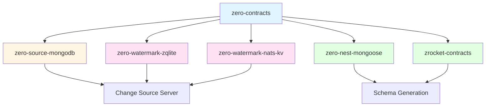

# Zero Sources Package Quick Reference

Quick reference guide for all packages in the zero-sources monorepo.

## 📦 Package Overview

### Core Infrastructure

| Package             | npm Package                      | Purpose                                        | Size     |
| ------------------- | -------------------------------- | ---------------------------------------------- | -------- |
| zero-contracts      | `@cbnsndwch/zero-contracts`      | Core contracts, protocols, and utilities       | 5.75 KB  |
| zero-source-mongodb | `@cbnsndwch/zero-source-mongodb` | MongoDB change source with WebSocket streaming | 9.35 KB  |
| zero-nest-mongoose  | `@cbnsndwch/zero-nest-mongoose`  | Auto-generate Zero schemas from Mongoose       | 10.13 KB |

### Watermark Storage

| Package                | npm Package                         | Purpose                               | Size     |
| ---------------------- | ----------------------------------- | ------------------------------------- | -------- |
| zero-watermark-zqlite  | `@cbnsndwch/zero-watermark-zqlite`  | SQLite-backed watermark storage       | 10.82 KB |
| zero-watermark-nats-kv | `@cbnsndwch/zero-watermark-nats-kv` | Distributed NATS KV watermark storage | 12.70 KB |

### Application Schemas

| Package           | npm Package                    | Purpose                          | Size    |
| ----------------- | ------------------------------ | -------------------------------- | ------- |
| zrocket-contracts | `@cbnsndwch/zrocket-contracts` | ZRocket chat application schemas | 9.99 KB |

### Configuration

| Package       | Workspace Package     | Purpose                         | Size    |
| ------------- | --------------------- | ------------------------------- | ------- |
| eslint-config | `@repo/eslint-config` | Shared ESLint configuration     | 4.25 KB |
| tsconfig      | `@repo/tsconfig`      | Shared TypeScript configuration | 7.60 KB |

## 🚀 Quick Start Patterns

### Building a MongoDB Change Source

```typescript
// 1. Install dependencies
pnpm add @cbnsndwch/zero-source-mongodb @cbnsndwch/zero-watermark-zqlite

// 2. Setup module
import { ZeroMongoModule } from '@cbnsndwch/zero-source-mongodb';

@Module({
    imports: [
        MongooseModule.forRoot('mongodb://localhost:27017/mydb'),
        ZeroMongoModule.forRoot({
            schema: { source: 'inline', tables: { /* ... */ } },
            collections: ['users', 'posts'],
        }),
    ],
})
export class AppModule {}

// 3. Start server
const app = await NestFactory.create(AppModule);
await app.listen(8001);
```

### Generating Schemas from Mongoose

```typescript
// 1. Install
pnpm add @cbnsndwch/zero-nest-mongoose

// 2. Generate schema
import { generateZeroSchema } from '@cbnsndwch/zero-nest-mongoose';

const userTable = generateZeroSchema(UserSchema, 'users');
const schema = createSchema({
    version: 1,
    tables: { users: userTable },
});
```

### Using Watermark Storage

```typescript
// SQLite (Single Instance)
pnpm add @cbnsndwch/zero-watermark-zqlite

ZeroWatermarkZqliteModule.forRoot({
    database: './watermarks.db',
})

// NATS KV (Distributed)
pnpm add @cbnsndwch/zero-watermark-nats-kv

ZeroWatermarkNatsKvModule.forRoot({
    servers: ['nats://localhost:4222'],
    bucket: 'zero-watermarks',
})
```

## 🎯 Use Case Guide

### Scenario 1: Single-Server MongoDB Sync

**Recommended Packages:**

- `@cbnsndwch/zero-source-mongodb`
- `@cbnsndwch/zero-watermark-zqlite`
- `@cbnsndwch/zero-nest-mongoose` (optional, for auto-generation)

**Why:** SQLite watermarks are perfect for single-instance deployments, and the MongoDB source handles all change streaming.

### Scenario 2: Distributed Multi-Instance Sync

**Recommended Packages:**

- `@cbnsndwch/zero-source-mongodb`
- `@cbnsndwch/zero-watermark-nats-kv`
- `@cbnsndwch/zero-contracts`

**Why:** NATS KV provides distributed watermark coordination across multiple change source instances.

### Scenario 3: Chat/Messaging Application

**Recommended Packages:**

- `@cbnsndwch/zrocket-contracts` (as reference)
- `@cbnsndwch/zero-source-mongodb`
- `@cbnsndwch/zero-nest-mongoose`

**Why:** ZRocket contracts demonstrate discriminated union patterns perfect for chat apps with different room and message types.

### Scenario 4: Auto-Generated Schemas

**Recommended Packages:**

- `@cbnsndwch/zero-nest-mongoose`
- `@cbnsndwch/zero-contracts`

**Why:** Automatically generate Zero schemas from your existing Mongoose models without manual duplication.

## 🔗 Package Dependencies



## 📚 Documentation Links

| Package                | README                                             | npm                                                                                              |
| ---------------------- | -------------------------------------------------- | ------------------------------------------------------------------------------------------------ |
| zero-contracts         | [README](../libs/zero-contracts/README.md)         | [@cbnsndwch/zero-contracts](https://npmjs.com/package/@cbnsndwch/zero-contracts)                 |
| zero-source-mongodb    | [README](../libs/zero-source-mongodb/README.md)    | [@cbnsndwch/zero-source-mongodb](https://npmjs.com/package/@cbnsndwch/zero-source-mongodb)       |
| zero-nest-mongoose     | [README](../libs/zero-nest-mongoose/README.md)     | [@cbnsndwch/zero-nest-mongoose](https://npmjs.com/package/@cbnsndwch/zero-nest-mongoose)         |
| zero-watermark-zqlite  | [README](../libs/zero-watermark-zqlite/README.md)  | [@cbnsndwch/zero-watermark-zqlite](https://npmjs.com/package/@cbnsndwch/zero-watermark-zqlite)   |
| zero-watermark-nats-kv | [README](../libs/zero-watermark-nats-kv/README.md) | [@cbnsndwch/zero-watermark-nats-kv](https://npmjs.com/package/@cbnsndwch/zero-watermark-nats-kv) |
| zrocket-contracts      | [README](../libs/zrocket-contracts/README.md)      | [@cbnsndwch/zrocket-contracts](https://npmjs.com/package/@cbnsndwch/zrocket-contracts)           |
| eslint-config          | [README](../libs/eslint-config/README.md)          | Workspace only                                                                                   |
| tsconfig               | [README](../libs/tsconfig/README.md)               | Workspace only                                                                                   |

## 🎨 Features Comparison

### Watermark Storage

| Feature              | SQLite (zqlite)      | NATS KV (nats-kv)   |
| -------------------- | -------------------- | ------------------- |
| **Setup Complexity** | ✅ Simple            | ⚠️ Requires NATS    |
| **Distribution**     | ❌ Single instance   | ✅ Multi-instance   |
| **Latency**          | 🚀 Local disk (<1ms) | ⚡ Network (~5ms)   |
| **Scalability**      | ⚠️ Vertical only     | ✅ Horizontal       |
| **Replication**      | ❌ Manual            | ✅ Automatic        |
| **Best For**         | Single servers       | Distributed systems |

### Schema Management

| Feature                  | Manual         | zero-nest-mongoose | zrocket-contracts |
| ------------------------ | -------------- | ------------------ | ----------------- |
| **Type Safety**          | ✅             | ✅                 | ✅                |
| **Auto-generation**      | ❌             | ✅                 | ❌                |
| **Discriminated Unions** | ✅             | ⚠️ Manual          | ✅                |
| **Mongoose Integration** | ❌             | ✅                 | ❌                |
| **Best For**             | Custom schemas | Existing Mongoose  | Chat/messaging    |

## 💡 Pro Tips

### 1. Schema Management

```bash
# Generate schemas at build time
pnpm --filter @cbnsndwch/zrocket-contracts build:schema
```

### 2. Development Workflow

```bash
# Watch mode for library development
pnpm --filter @cbnsndwch/zero-contracts dev

# Test specific package
pnpm --filter @cbnsndwch/zero-source-mongodb test
```

### 3. Type Safety

```typescript
// Import types for full IntelliSense
import type { Watermark, UpstreamProtocol } from '@cbnsndwch/zero-contracts';
```

### 4. Configuration

```yaml
# Use environment variables for configuration
schema:
    source: ${SCHEMA_SOURCE:-url}
    schemaUrl: ${SCHEMA_URL}
```

## 🔧 Common Commands

```bash
# Install all dependencies
pnpm install

# Build all packages
pnpm build

# Test all packages
pnpm test

# Lint all packages
pnpm lint

# Build specific package
pnpm --filter @cbnsndwch/zero-contracts build

# Run specific app
pnpm --filter source-mongodb-server dev
```

## 🌐 External Resources

- [Rocicorp Zero Documentation](https://zero.rocicorp.dev/)
- [MongoDB Change Streams](https://www.mongodb.com/docs/manual/changeStreams/)
- [NestJS Documentation](https://docs.nestjs.com/)
- [NATS JetStream](https://docs.nats.io/nats-concepts/jetstream)
- [Architecture Guide](./refactor/README-SEPARATED-ARCHITECTURE.md)

## 📝 License

All packages are licensed under MIT. See [LICENSE.md](../LICENSE.md) for details.

---

**Last Updated:** October 4, 2025  
**Total Packages:** 8  
**Documentation Size:** ~81 KB  
**Status:** ✅ Ready for npm publication
