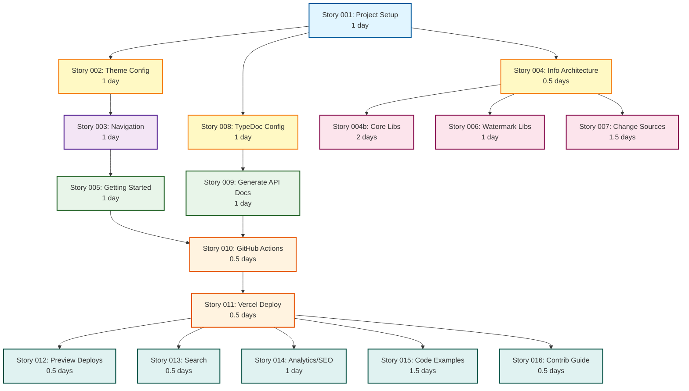

# Product Requirements Document: Fumadocs Documentation Site

**Project Name**: Fumadocs Documentation Site for zero-sources
**Version**: 1.0
**Date**: November 1, 2025
**Status**: Draft

---

## Project Information

**Project Code**: `FDS` (FumaDocs Site)
**Work Item Prefix**: All epics and stories use the `FDS` prefix

- Epics: `FDS-EPIC-###`7
- Stories: `FDS-STORY-###`

## Executive Summary

The zero-sources monorepo contains a growing collection of libraries and change source implementations for Rocicorp Zero. While comprehensive README files exist, the project lacks a unified, discoverable, and user-friendly documentation platform that would help the community understand, adopt, and contribute to the ecosystem.

This PRD outlines the requirements for building a modern documentation website using Fumadocs 16, a Next.js 16-based documentation framework that provides excellent developer experience, beautiful UI/UX, and powerful features like search, API documentation generation, and interactive examples.

## Problem Statement

### Current Challenges

1. **Discoverability**: Documentation is scattered across multiple README files in different directories
2. **Navigation**: No unified navigation structure makes it difficult to explore related libraries
3. **Search**: No way to search across all documentation
4. **API Reference**: No auto-generated API documentation for TypeScript libraries
5. **Examples**: Limited interactive examples and code snippets
6. **Onboarding**: High friction for new users trying to get started
7. **SEO**: Poor search engine visibility for individual libraries
8. **Maintenance**: Documentation updates require manual edits to multiple files

### User Pain Points

- **New Users**: "I don't know where to start or what libraries are available"
- **Existing Users**: "I can't find specific API methods or examples easily"
- **Contributors**: "It's hard to understand the full architecture and how pieces fit together"
- **Community**: "I want to share specific documentation pages but can't link to them easily"

## Goals and Objectives

### Primary Goals

1. **Improve Discoverability**: Create a centralized hub where users can discover all libraries and features
2. **Enhance User Experience**: Provide intuitive navigation, search, and beautiful design
3. **Reduce Time-to-Productivity**: Help new users get started quickly with clear guides
4. **Increase Adoption**: Make it easier for developers to understand and use zero-sources libraries
5. **Streamline Maintenance**: Integrate documentation updates into the development workflow

### Secondary Goals

1. Enable community contributions to documentation
2. Improve SEO and online visibility
3. Provide analytics on documentation usage
4. Support multiple documentation versions (future)
5. Enable internationalization (future)

### Success Metrics

| Metric | Current | Target | Timeline |
|--------|---------|--------|----------|
| Documentation page views | N/A | 1,000/month | 3 months |
| Time to first library integration | Unknown | < 30 minutes | Launch |
| Search usage rate | N/A | > 40% | 1 month |
| Community contributions (docs) | Rare | 5+ PRs/quarter | 6 months |
| Page load time | N/A | < 2 seconds | Launch |
| SEO ranking for key terms | Low | Top 10 | 6 months |

## User Personas

### Persona 1: The Curious Developer

**Name**: Alex, Frontend Developer
**Experience**: 2-3 years with React, new to Rocicorp Zero
**Goals**: 
- Understand what zero-sources offers
- Find the right library for real-time data sync needs
- See working examples before committing
**Frustrations**:
- Overwhelmed by technical jargon
- Needs clear, visual explanations
- Wants to see code examples immediately

### Persona 2: The Backend Integrator

**Name**: Jordan, Backend Engineer
**Experience**: 5+ years, experienced with NestJS and MongoDB
**Goals**:
- Implement MongoDB change source for production
- Understand configuration options and best practices
- Find API reference documentation quickly
**Frustrations**:
- Needs comprehensive API docs
- Wants to see advanced configuration examples
- Requires troubleshooting guides

### Persona 3: The Open Source Contributor

**Name**: Sam, Full-Stack Developer
**Experience**: 3-5 years, active in open source
**Goals**:
- Understand the architecture to contribute
- Find areas where documentation is lacking
- Help improve documentation and examples
**Frustrations**:
- Hard to understand how components interact
- Unclear contributing guidelines for docs
- No easy way to test documentation locally

### Persona 4: The Tech Lead/Architect

**Name**: Casey, Technical Lead
**Experience**: 10+ years, making architecture decisions
**Goals**:
- Evaluate zero-sources for team adoption
- Understand performance, scalability, and limitations
- Compare different watermark storage options
**Frustrations**:
- Needs high-level architecture overview
- Wants to see production deployment guides
- Requires detailed comparison tables

## Functional Requirements

### FR-1: Site Infrastructure

#### FR-1.1: Project Setup
- Create new Fumadocs project in `apps/docs` directory
- Integrate with existing Turborepo and pnpm workspace
- Configure TypeScript with strict type checking
- Set up ESLint and Prettier for consistency

#### FR-1.2: Theme and Branding
- Implement custom theme matching zero-sources branding
- Configure dark/light mode support
- Create custom logo and favicon
- Design consistent typography and spacing

#### FR-1.3: Navigation Structure
- Implement multi-level navigation sidebar
- Create breadcrumb navigation
- Add table of contents for long pages
- Implement mobile-responsive navigation

### FR-2: Content Organization

#### FR-2.1: Information Architecture
- **Home Page**: Project overview, key features, quick start links
- **Getting Started**: Installation, configuration, first steps
- **Libraries**: Individual library documentation
  - `@cbnsndwch/zero-contracts`: Core contracts and utilities
  - `@cbnsndwch/zero-source-mongodb`: MongoDB change source
  - `@cbnsndwch/zero-watermark-zqlite`: ZQLite watermark storage
  - `@cbnsndwch/zero-watermark-nats-kv`: NATS KV watermark storage
  - `@cbnsndwch/zero-nest-mongoose`: NestJS integration utilities
  - `@cbnsndwch/synced-queries`: Synced queries encapsulation
  - `@cbnsndwch/zrocket-contracts`: ZRocket demo schemas
- **Change Sources**: Custom change source implementations
  - `source-mongodb-server`: MongoDB change source server
- **Demos**: ZRocket and other demo applications
- **Guides**: How-to guides and tutorials
- **API Reference**: Auto-generated API documentation
- **Architecture**: System architecture and design decisions

#### FR-2.2: Content Migration
- Migrate existing README content to MDX format
- Preserve existing documentation structure where beneficial
- Update links to point to new documentation site
- Add frontmatter metadata to all pages

### FR-3: Documentation Features

#### FR-3.1: Code Examples
- Syntax highlighting for TypeScript, JavaScript, Bash
- Copy-to-clipboard functionality
- Line highlighting and annotations
- Multiple code tabs for different languages/frameworks

#### FR-3.2: Interactive Components
- Collapsible sections for long content
- Tabs for alternative approaches
- Callout boxes (info, warning, danger, success)
- Step-by-step guides with progress indicators

#### FR-3.3: API Documentation
- Integrate TypeDoc for automatic API generation
- Generate API docs from TypeScript source
- Link API references from narrative documentation
- Update API docs on build

#### FR-3.4: Search Functionality
- Full-text search across all documentation
- Search result highlighting
- Keyboard shortcuts (Cmd/Ctrl + K)
- Search suggestions and autocomplete

### FR-4: User Experience

#### FR-4.1: Performance
- Static site generation for optimal performance
- Image optimization
- Code splitting and lazy loading
- Service worker for offline access (progressive)

#### FR-4.2: Accessibility
- WCAG 2.1 AA compliance
- Keyboard navigation support
- Screen reader compatibility
- Semantic HTML structure

#### FR-4.3: Mobile Responsiveness
- Mobile-optimized navigation
- Touch-friendly interactive elements
- Responsive images and code blocks
- Fast mobile performance

### FR-5: Developer Experience

#### FR-5.1: Local Development
- Hot module replacement for fast iteration
- Clear development setup instructions
- Integrated with existing monorepo scripts
- Localhost preview functionality

#### FR-5.2: Content Authoring
- MDX support for interactive documentation
- Component library for common patterns
- Documentation templates
- Style guide for consistency

#### FR-5.3: Build and Deployment
- Automated builds via Turborepo
- Static export for hosting flexibility
- Preview deployments for PRs
- Production deployment automation

## Non-Functional Requirements

### NFR-1: Performance
- **Page Load**: First contentful paint < 1.5 seconds
- **Time to Interactive**: < 3 seconds on 3G connection
- **Lighthouse Score**: > 90 across all categories
- **Build Time**: < 5 minutes for full site build

### NFR-2: Scalability
- Support 100+ documentation pages without performance degradation
- Handle 10,000+ monthly visitors
- Efficient search indexing for growing content

### NFR-3: Maintainability
- Clear file organization and naming conventions
- Automated checks for broken links
- Documentation linting for consistency
- Version-controlled content

### NFR-4: Reliability
- 99.9% uptime for hosted documentation
- Automated backups of content
- Rollback capability for problematic deployments

### NFR-5: Security
- HTTPS for all traffic
- No client-side secrets or API keys
- Content Security Policy headers
- Regular dependency updates

## Technical Architecture

### System Components

```
┌─────────────────────────────────────────────────────────┐
│                     Users / Community                    │
└───────────────────────┬─────────────────────────────────┘
                        │
                        ↓
┌─────────────────────────────────────────────────────────┐
│              Vercel / Static Hosting CDN                 │
│  ┌────────────────────────────────────────────────────┐ │
│  │         Static Site (Next.js SSG Output)           │ │
│  │  • Pre-rendered HTML pages                         │ │
│  │  • Search index (client-side)                      │ │
│  │  • Assets (CSS, JS, images)                        │ │
│  └────────────────────────────────────────────────────┘ │
└─────────────────────────────────────────────────────────┘
                        ↑
                        │ Build & Deploy
                        │
┌─────────────────────────────────────────────────────────┐
│                    GitHub Actions CI/CD                  │
│  • Trigger on push to main                              │
│  • Run Turborepo build                                  │
│  • Generate API docs (TypeDoc)                          │
│  • Build Fumadocs site                                  │
│  • Deploy to Vercel                                     │
└─────────────────────────────────────────────────────────┘
                        ↑
                        │
┌─────────────────────────────────────────────────────────┐
│                   zero-sources Monorepo                  │
│  apps/docs/                                             │
│  ├── app/                  # Next.js App Router         │
│  ├── content/              # MDX documentation files    │
│  ├── public/               # Static assets              │
│  ├── components/           # Custom React components    │
│  ├── fumadocs.config.ts    # Fumadocs configuration     │
│  ├── next.config.mjs       # Next.js configuration      │
│  └── package.json          # Dependencies               │
│                                                          │
│  libs/*/                   # Source for API docs        │
└─────────────────────────────────────────────────────────┘
```

### Technology Stack Details

| Layer | Technology | Justification |
|-------|------------|---------------|
| Framework | Next.js 16 | Industry standard, excellent SSG, Vercel-optimized, latest features |
| Documentation | Fumadocs 16 | Purpose-built for docs, great DX, modern UI, latest improvements |
| Content Format | MDX | Markdown + React components, flexible |
| Styling | Tailwind CSS | Utility-first, consistent with Fumadocs |
| Search | Flexsearch | Fast client-side search, no backend needed |
| API Docs | TypeDoc | TypeScript-native, integrates well |
| Build Tool | Turborepo | Already in use, caching, parallel builds |
| Package Manager | pnpm | Already in use, fast, efficient |
| Hosting | Vercel | Fumadocs optimized, free tier, excellent DX |
| CI/CD | GitHub Actions | Native GitHub integration, flexible |

### Content Structure

```
apps/docs/content/
├── index.mdx                          # Home page
├── getting-started/
│   ├── index.mdx                      # Getting started overview
│   ├── installation.mdx               # Installation guide
│   ├── quick-start.mdx                # Quick start guide
│   └── concepts.mdx                   # Core concepts
├── libraries/
│   ├── index.mdx                      # Libraries overview
│   ├── zero-contracts/
│   │   ├── index.mdx                  # Library overview
│   │   ├── installation.mdx           # Installation
│   │   ├── usage.mdx                  # Usage guide
│   │   ├── api/                       # API reference (generated)
│   │   └── examples.mdx               # Code examples
│   ├── zero-source-mongodb/
│   │   ├── index.mdx
│   │   ├── configuration.mdx          # Configuration guide
│   │   ├── discriminated-unions.mdx   # Feature documentation
│   │   ├── change-streams.mdx         # Change streams guide
│   │   └── api/
│   ├── zero-watermark-zqlite/
│   │   └── ...
│   └── ...
├── change-sources/
│   ├── index.mdx                      # Change sources overview
│   ├── mongodb-server/
│   │   ├── index.mdx
│   │   ├── deployment.mdx             # Deployment guide
│   │   ├── configuration.mdx          # Configuration
│   │   └── monitoring.mdx             # Monitoring guide
│   └── custom-implementation.mdx      # Building custom sources
├── demos/
│   ├── index.mdx                      # Demos overview
│   ├── zrocket/
│   │   ├── index.mdx                  # ZRocket overview
│   │   ├── architecture.mdx           # Architecture deep dive
│   │   ├── running-locally.mdx        # Local setup
│   │   └── deployment.mdx             # Deployment guide
│   └── ...
├── guides/
│   ├── index.mdx                      # Guides overview
│   ├── setting-up-change-source.mdx   # How-to guide
│   ├── watermark-storage.mdx          # Choosing watermark storage
│   ├── docker-deployment.mdx          # Docker deployment
│   ├── troubleshooting.mdx            # Common issues
│   └── ...
└── architecture/
    ├── index.mdx                      # Architecture overview
    ├── change-source-protocol.mdx     # Protocol documentation
    ├── watermark-system.mdx           # Watermark architecture
    └── monorepo-structure.mdx         # Monorepo organization
```

## Design and User Interface

### Visual Design Principles

1. **Clean and Modern**: Minimalist design focusing on content
2. **Professional**: Instill confidence in production readiness
3. **Approachable**: Welcoming to developers of all skill levels
4. **Consistent**: Unified design language across all pages

### Key UI Components

#### Home Page
- Hero section with project tagline and CTA
- Feature grid highlighting key capabilities
- Quick start code snippet
- Library showcase with icons
- Community links (GitHub, discussions, Discord)

#### Documentation Page Layout
```
┌──────────────────────────────────────────────────────────┐
│  Header: Logo | Navigation | Search | Theme | GitHub     │
├────────────┬──────────────────────────────┬──────────────┤
│            │                              │              │
│  Sidebar   │     Main Content Area        │  Table of    │
│  Navigation│                              │  Contents    │
│            │  - Breadcrumbs               │              │
│  • Getting │  - Page Title                │  • Section 1 │
│    Started │  - Content                   │  • Section 2 │
│  • Lib 1   │  - Code Examples             │  • Section 3 │
│    - Guide │  - Interactive Components    │              │
│    - API   │                              │              │
│  • Lib 2   │                              │              │
│            │                              │              │
│            │                              │              │
├────────────┴──────────────────────────────┴──────────────┤
│  Footer: Copyright | Links | Version                     │
└──────────────────────────────────────────────────────────┘
```

#### Component Patterns

**Code Block**
```typescript
// Title: Example with annotation
import { createZero } from '@cbnsndwch/zero-contracts';

const zero = createZero({
  // Configuration options
  server: 'http://localhost:4848',
});
```

**Callout Box**
> **Info**: This is an informational callout
> 
> **Warning**: This is a warning callout
> 
> **Danger**: This is a danger callout

**Tabs**
```
[Tab: npm] [Tab: pnpm] [Tab: yarn]
Content changes based on tab selection
```

**Step-by-Step Guide**
```
1. Install dependencies
   - Run `pnpm install`
   - Verify installation

2. Configure environment
   - Create `.env` file
   - Add required variables

3. Start development server
   - Run `pnpm dev`
   - Open browser
```

## Content Strategy

### Content Types

1. **Conceptual Documentation**: Explain "what" and "why"
   - Architecture overviews
   - Design decisions
   - Use cases and patterns

2. **Task-Based Guides**: Explain "how to"
   - Step-by-step tutorials
   - Configuration guides
   - Troubleshooting guides

3. **Reference Documentation**: Technical specifications
   - API documentation
   - Configuration options
   - Type definitions

4. **Examples and Samples**: Working code
   - Quick start examples
   - Full application demos
   - Integration patterns

### Content Principles

1. **Progressive Disclosure**: Start simple, layer complexity
2. **Learning Paths**: Guide users from beginner to advanced
3. **Working Examples**: Every concept includes runnable code
4. **Consistency**: Same structure and style across all docs
5. **Freshness**: Keep documentation up-to-date with code

### Maintenance Strategy

1. **Documentation Reviews**: Review docs with each feature release
2. **Community Feedback**: Accept and review documentation PRs
3. **Analytics-Driven**: Use analytics to identify gaps and confusion
4. **Automated Checks**: Link checking, spell checking, linting
5. **Version Syncing**: Keep docs version in sync with library versions

## Integration Requirements

### IR-1: Monorepo Integration
- Add `apps/docs` to pnpm workspace
- Configure Turborepo for docs build
- Add docs-specific scripts to root package.json
- Ensure docs build doesn't break other apps

### IR-2: API Documentation Generation
- Configure TypeDoc for each library
- Generate API docs during build process
- Link generated docs from narrative documentation
- Update on library version changes

### IR-3: GitHub Integration
- Set up GitHub Actions workflow
- Configure preview deployments for PRs
- Add documentation badges to README
- Link to docs from GitHub repo

### IR-4: Vercel Deployment
- Create Vercel project
- Configure build settings
- Set up custom domain (optional)
- Configure preview deployments

## Deployment Strategy

### Development Environment
```bash
# Local development
cd apps/docs
pnpm install
pnpm dev        # Start dev server at localhost:3000
```

### Build Process
```bash
# From monorepo root
pnpm build      # Builds all apps including docs
# OR
turbo run build --filter=docs
```

### Deployment Pipeline

1. **Trigger**: Push to `main` branch or documentation-related branches
2. **Build**: GitHub Actions runs Turborepo build
3. **API Docs**: TypeDoc generates API documentation
4. **Static Export**: Next.js generates static site
5. **Deploy**: Upload to Vercel (or alternative)
6. **Verify**: Run smoke tests on deployed site

### Hosting Options

**Recommended: Vercel**
- Pros: Fumadocs optimized, free tier, automatic previews, excellent DX
- Cons: Vendor lock-in (mitigated by static export)

**Alternative: Netlify**
- Pros: Free tier, good DX, flexible
- Cons: Less optimized for Next.js

**Alternative: GitHub Pages**
- Pros: Free, integrated with GitHub
- Cons: No automatic preview deployments, less flexible

**Alternative: Cloudflare Pages**
- Pros: Free, fast CDN, good DX
- Cons: Slightly more complex setup

## Risk Assessment and Mitigation

| Risk | Probability | Impact | Mitigation |
|------|-------------|--------|------------|
| Content migration takes longer than expected | Medium | Medium | Start with high-priority libraries, migrate incrementally |
| Fumadocs breaks with Next.js updates | Low | Medium | Pin versions, test upgrades in separate branch |
| Poor SEO performance | Low | Medium | Implement proper meta tags, sitemap, structured data |
| High hosting costs at scale | Low | Low | Use free tier (Vercel), optimize assets, monitor usage |
| Community doesn't adopt new docs | Medium | High | Communicate clearly, preserve old READMEs initially, gather feedback |
| API doc generation fails | Medium | Medium | Test TypeDoc integration early, have manual fallback |
| Deployment pipeline issues | Low | Medium | Test CI/CD thoroughly, have manual deployment process |
| Maintenance burden increases | Medium | Medium | Automate where possible, accept community contributions |

## Dependencies and Constraints

### Dependencies

**External:**
- Fumadocs framework and ecosystem
- Next.js framework
- TypeDoc for API generation
- Hosting provider (Vercel or alternative)

**Internal:**
- Turborepo build system
- Existing library documentation
- pnpm workspace configuration
- TypeScript source code for API docs

### Constraints

**Technical:**
- Must integrate with existing Turborepo monorepo
- Must use pnpm as package manager
- Must maintain compatibility with existing build process
- Must not slow down existing builds significantly

**Resource:**
- Initial implementation by single developer
- Community contributions expected but not guaranteed
- Limited design resources (use Fumadocs defaults)

**Timeline:**
- Should not delay library development work
- Incremental migration acceptable
- MVP within 2-3 weeks

## Story Concurrency and Execution Plan

The following diagram illustrates which user stories can be executed in parallel and their dependencies. Stories are organized into waves, where all stories within a wave can be executed concurrently.



### Execution Waves

**Wave 1: Foundation** (1 day)

- Story 001: Project Setup (CRITICAL - blocks all other work)

**Wave 2: Parallel Configuration** (1 day)

- Story 002: Theme Configuration
- Story 004: Information Architecture
- Story 008: TypeDoc Integration Configuration
- *All three can proceed in parallel after Story 001*

**Wave 3: Navigation** (1 day)

- Story 003: Navigation Structure (requires Theme)

**Wave 4: Initial Content** (1 day)

- Story 005: Getting Started Guide (requires Navigation)
- Story 009: Generate API Docs (requires TypeDoc Config)
- *Both can proceed in parallel*

**Wave 5: Documentation Migration** (2 days max)

- Story 004b: Core Library Documentation (2 days)
- Story 006: Watermark Libraries Documentation (1 day)
- Story 007: Change Source Documentation (1.5 days)
- *All three can proceed in parallel after Info Architecture*
- *Wave completes when longest task (004b) finishes*

**Wave 6: Deployment Setup** (0.5-1 day sequential)

- Story 010: GitHub Actions Configuration (0.5 days)
- Story 011: Vercel Deployment (0.5 days, depends on 010)

**Wave 7: Community Features** (1.5 days max)

- Story 012: Preview Deployments (0.5 days)
- Story 013: Search Functionality (0.5 days)
- Story 014: Analytics and SEO (1 day)
- Story 015: Interactive Code Examples (1.5 days)
- Story 016: Contribution Guidelines (0.5 days)
- *All five can proceed in parallel after deployment*

### Timeline Summary

With optimal parallelization and a team of 3-4 developers:

- **Minimum Duration**: 7.5 days (sequential critical path)
- **With 2 developers**: ~10 days
- **With 1 developer**: ~15 days (all sequential)

### Critical Path

The critical path (longest dependency chain) is:

```text
Story 001 (1d) → Story 002 (1d) → Story 003 (1d) → Story 005 (1d) → 
Story 010 (0.5d) → Story 011 (0.5d) → Story 015 (1.5d) = 7.5 days
```

### Parallelization Opportunities

**High Parallelization** (3-5 simultaneous stories):

- Wave 2: 3 parallel stories
- Wave 5: 3 parallel stories  
- Wave 7: 5 parallel stories

**Sequential Bottlenecks**:

- Story 001 must complete first
- Navigation (Story 003) must complete before getting started content
- Deployment setup (Stories 010-011) are sequential

## Acceptance Criteria

### Phase 1: MVP (Minimum Viable Product)

- [ ] Fumadocs project set up in `apps/docs`
- [ ] Basic theme and branding applied
- [ ] Navigation structure implemented
- [ ] Home page with project overview
- [ ] Getting started guide migrated
- [ ] At least 3 library docs migrated
- [ ] Search functionality working
- [ ] Code syntax highlighting working
- [ ] Mobile-responsive design
- [ ] Deployed to production URL
- [ ] CI/CD pipeline functional

### Phase 2: Full Migration

- [ ] All library documentation migrated
- [ ] All change source docs migrated
- [ ] Demo application documentation complete
- [ ] Architecture documentation added
- [ ] API reference documentation generated
- [ ] All existing docs/guides migrated
- [ ] Analytics implemented
- [ ] SEO optimization complete
- [ ] Community contribution guide added

### Phase 3: Enhanced Features

- [ ] Interactive code examples
- [ ] Video tutorials embedded
- [ ] Community showcase section
- [ ] Advanced search filters
- [ ] Documentation versioning
- [ ] Internationalization (i18n) support

## Future Enhancements

### Post-Launch Improvements

1. **Versioned Documentation**: Support multiple version of docs for each library
2. **Interactive Playground**: In-browser code execution for examples
3. **Video Content**: Tutorial videos and screencasts
4. **Community Showcase**: Gallery of projects using zero-sources
5. **Internationalization**: Support for multiple languages
6. **Advanced Analytics**: Detailed usage metrics and heatmaps
7. **AI-Powered Search**: Natural language search with LLM integration
8. **Documentation Testing**: Automated testing of code examples
9. **Contribution Metrics**: Gamification for documentation contributors
10. **Integration Examples**: Pre-built templates and starters

## Stakeholder Sign-off

| Stakeholder | Role | Sign-off Date | Signature |
|-------------|------|---------------|-----------|
| Product Manager | Requirements Owner | _Pending_ | ___________ |
| Lead Developer | Technical Feasibility | _Pending_ | ___________ |
| Documentation Specialist | Content Strategy | _Pending_ | ___________ |
| Project Owner | Final Approval | _Pending_ | ___________ |

## Appendices

### Appendix A: Fumadocs Features Reference

**Core Features:**
- Built on Next.js App Router
- MDX support with custom components
- Full-text search (Flexsearch)
- Dark/light theme switching
- Mobile-responsive design
- Table of contents generation
- Breadcrumb navigation
- Sidebar navigation with nested sections
- Code block enhancements (copy, line highlighting)
- TypeScript-first with type safety

**Advanced Features:**
- API reference generation support
- Custom components and layouts
- Plugin system for extensions
- Internationalization support
- Version management
- Analytics integration
- SEO optimization built-in

### Appendix B: Content Migration Checklist

For each library/module being migrated:

- [ ] Create directory structure in `content/`
- [ ] Migrate README.md to index.mdx
- [ ] Add frontmatter metadata
- [ ] Convert markdown to MDX where needed
- [ ] Add code examples with syntax highlighting
- [ ] Create installation guide
- [ ] Create usage guide
- [ ] Generate or write API reference
- [ ] Add navigation entry
- [ ] Test all links
- [ ] Add to search index
- [ ] Review for accuracy and clarity

### Appendix C: Resource Links

- [Fumadocs Documentation](https://fumadocs.vercel.app/)
- [Next.js Documentation](https://nextjs.org/docs)
- [MDX Documentation](https://mdxjs.com/)
- [TypeDoc Documentation](https://typedoc.org/)
- [Turborepo Documentation](https://turbo.build/repo/docs)
- [Vercel Deployment Guide](https://vercel.com/docs)

---

**Document Version**: 1.0
**Last Updated**: November 1, 2025
**Next Review Date**: TBD
