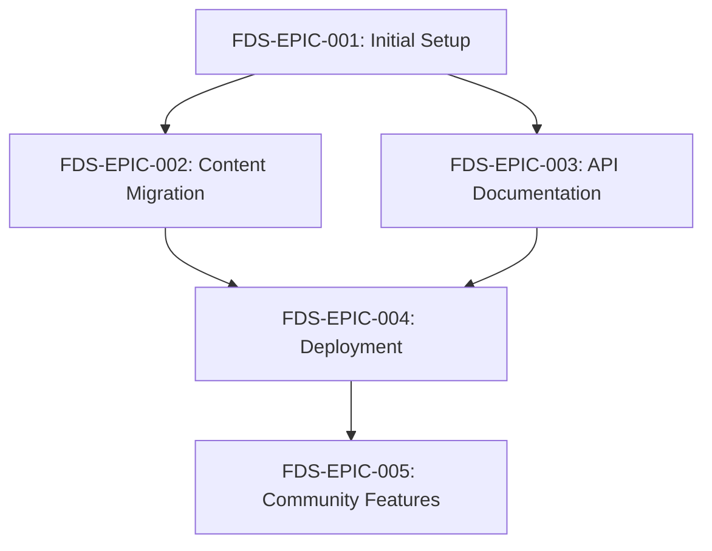

# Epics Overview

This directory contains high-level epic descriptions for the Fumadocs Documentation Site project. Each epic represents a major feature area or milestone that encompasses multiple user stories.

## Project Prefix

**Project Code**: `FDS` (FumaDocs Site)

All epics use the format: `FDS-EPIC-###`

## Epic List

### [Epic 001: Initial Setup and Configuration](./epic-001-initial-setup.md)

**Epic ID**: FDS-EPIC-001
**Status**: Not Started
**Priority**: Critical
**Estimated Effort**: 2-3 days

Set up the foundational Fumadocs project structure, integrate with the existing monorepo, and configure the basic development environment.

**Key Deliverables**:

- Fumadocs project scaffolded in `apps/docs`
- Turborepo and pnpm workspace integration
- Basic theme and branding configuration
- Navigation structure implemented
- Local development environment working

---

### [Epic 002: Content Migration and Organization](./epic-002-content-migration.md)

**Epic ID**: FDS-EPIC-002
**Status**: Not Started
**Priority**: High
**Estimated Effort**: 5-7 days

Migrate existing documentation from scattered README files to the structured Fumadocs content format, ensuring all libraries and change sources are properly documented.

**Key Deliverables**:

- Information architecture defined
- All library READMEs migrated to MDX
- Getting started guide created
- Architecture documentation migrated
- Internal linking implemented
- Search indexing configured

---

### [Epic 003: API Documentation Generation](./epic-003-api-documentation.md)

**Epic ID**: FDS-EPIC-003
**Status**: Not Started
**Priority**: High
**Estimated Effort**: 2 days

Implement automated API reference documentation generation from TypeScript source code using TypeDoc, integrated into the documentation site and build process.

**Key Deliverables**:

- TypeDoc configured for all libraries
- API documentation generation automated
- API docs integrated into navigation
- Cross-linking between narrative docs and API reference
- Build process updated to regenerate API docs

---

### [Epic 004: Deployment and CI/CD Pipeline](./epic-004-deployment-cicd.md)

**Epic ID**: FDS-EPIC-004
**Status**: Not Started
**Priority**: Critical
**Estimated Effort**: 1.5 days

Set up automated deployment pipeline with CI/CD, preview deployments for pull requests, and production hosting configuration.

**Key Deliverables**:

- GitHub Actions workflow created
- Vercel project configured
- Preview deployments for PRs
- Production deployment automated
- Custom domain configured (if applicable)
- Deployment monitoring set up

---

### [Epic 005: Community Features and Enhancements](./epic-005-community-features.md)

**Epic ID**: FDS-EPIC-005
**Status**: Not Started
**Priority**: Medium
**Estimated Effort**: 4 days

Add community-focused features including analytics, SEO optimization, contribution guidelines, and interactive elements to improve engagement and discoverability.

**Key Deliverables**:

- Analytics tracking implemented
- SEO optimization complete
- Contribution guidelines for documentation
- Social media meta tags
- Sitemap and robots.txt
- Interactive code examples
- Feedback mechanisms

---

## Epic Dependencies

**Critical Path**: FDS-EPIC-001 → FDS-EPIC-002 → FDS-EPIC-004

**Parallel Work Possible**: Epic 003 can be developed in parallel with Epic 002

## Overall Project Timeline

**Phase 1 - MVP** (Week 1-2):

- FDS-EPIC-001: Initial Setup ✓
- FDS-EPIC-002: Content Migration (partial - priority libraries only)
- FDS-EPIC-004: Deployment (basic setup)

**Phase 2 - Full Migration** (Week 3-4):

- FDS-EPIC-002: Content Migration (complete)
- FDS-EPIC-003: API Documentation
- FDS-EPIC-004: Deployment (enhanced with previews)

**Phase 3 - Enhancement** (Week 5+):

- FDS-EPIC-005: Community Features
- Polish and refinement
- Community feedback integration

## Success Metrics by Epic

### FDS-EPIC-001

- [ ] `pnpm dev` successfully starts documentation site
- [ ] Navigation structure matches planned information architecture
- [ ] Theme reflects zero-sources branding
- [ ] Site is mobile-responsive

### FDS-EPIC-002

- [ ] All library documentation migrated
- [ ] All internal links working
- [ ] Search returns relevant results
- [ ] Content follows style guide

### FDS-EPIC-003

- [ ] API documentation generated for all libraries
- [ ] API docs accessible from navigation
- [ ] Cross-references work between narrative and API docs
- [ ] API docs update automatically on library changes

### FDS-EPIC-004

- [ ] Production site deployed and accessible
- [ ] PR previews working
- [ ] Build time < 5 minutes
- [ ] Site loads in < 2 seconds

### FDS-EPIC-005

- [ ] Analytics tracking user behavior
- [ ] SEO score > 90 on Lighthouse
- [ ] Community contributions guidelines clear
- [ ] Interactive examples working

## Notes

- Each epic contains multiple user stories detailing specific implementation tasks
- Epics may be adjusted based on learnings and feedback during development
- Priority and effort estimates may change as work progresses
- Some epics can be worked on in parallel to accelerate delivery
