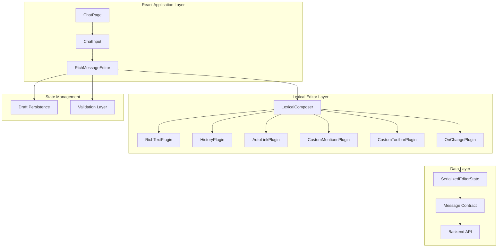

# Technical Architecture Document

# Rich Message Composer - Lexical Integration

**Project**: Rich Message Composer  
**Version**: 1.0.0  
**Date**: January 2025  
**Status**: Draft

---

## 1. Architecture Overview

This document outlines the technical architecture for integrating Lexical as a rich text editor to replace the current textarea-based message input in our chat application.

### 1.1 High-Level Architecture



### 1.2 Component Hierarchy

```
ChatInput (existing)
├── RichMessageEditor (new)
│   ├── LexicalComposer
│   │   ├── RichTextPlugin
│   │   ├── HistoryPlugin
│   │   ├── AutoLinkPlugin
│   │   ├── ListPlugin
│   │   ├── OnChangePlugin
│   │   ├── MentionsPlugin (custom)
│   │   ├── ToolbarPlugin (custom)
│   │   ├── DraftPersistencePlugin (custom)
│   │   └── ValidationPlugin (custom)
│   ├── ErrorBoundary
│   └── AccessibilityProvider
├── AttachmentButton (existing)
├── EmojiButton (existing)
└── SendButton (existing)
```

---

## 2. Core Components Design

### 2.1 RichMessageEditor Component

**Primary Responsibilities:**

- Manage Lexical editor instance and configuration
- Handle serialization to/from `SerializedEditorState`
- Provide interface for parent components
- Manage editor state and validation

**Interface:**

```typescript
interface RichMessageEditorProps {
    onSendMessage: (content: SerializedEditorState) => void;
    placeholder?: string;
    initialContent?: SerializedEditorState;
    onDraftChange?: (content: SerializedEditorState | null) => void;
    disabled?: boolean;
    maxLength?: number;
    autoFocus?: boolean;
}

interface RichMessageEditorRef {
    focus: () => void;
    clear: () => void;
    insertText: (text: string) => void;
    getContent: () => SerializedEditorState | null;
    setContent: (content: SerializedEditorState) => void;
}
```

### 2.2 Lexical Configuration

**Initial Config:**

```typescript
const initialConfig: InitialConfigType = {
    namespace: 'RichMessageEditor',
    theme: messageEditorTheme,
    onError: handleEditorError,
    nodes: [
        // Core nodes
        HeadingNode,
        ListNode,
        ListItemNode,
        QuoteNode,
        CodeNode,
        CodeHighlightNode,
        TableNode,
        TableCellNode,
        TableRowNode,
        HashtagNode,
        AutoLinkNode,
        LinkNode,
        // Custom nodes
        MentionNode,
        EmojiNode
    ],
    editorState: initialEditorState
};
```

**Theme Configuration:**

```typescript
const messageEditorTheme: EditorThemeClasses = {
    paragraph: 'editor-paragraph',
    text: {
        bold: 'editor-text-bold',
        italic: 'editor-text-italic',
        underline: 'editor-text-underline',
        strikethrough: 'editor-text-strikethrough',
        code: 'editor-text-code'
    },
    link: 'editor-link',
    list: {
        nested: {
            listitem: 'editor-nested-listitem'
        },
        ol: 'editor-list-ol',
        ul: 'editor-list-ul',
        listitem: 'editor-listitem'
    },
    // Custom theme classes
    mention: 'editor-mention',
    emoji: 'editor-emoji'
};
```

---

## 3. Plugin Architecture

### 3.1 Core Plugins (From Lexical)

#### RichTextPlugin

- **Purpose**: Provides basic rich text editing capabilities
- **Features**: Bold, italic, underline, strikethrough, copy/paste
- **Configuration**: Standard configuration with custom theme

#### HistoryPlugin

- **Purpose**: Undo/redo functionality
- **Features**: Command-based history with keyboard shortcuts
- **Configuration**: Standard with custom delay settings

#### AutoLinkPlugin

- **Purpose**: Automatic URL detection and linking
- **Features**: Real-time URL detection, click to open
- **Configuration**:

```typescript
const URL_MATCHER =
    /((https?:\/\/(www\.)?)|(www\.))[-a-zA-Z0-9@:%._+~#=]{1,256}\.[a-zA-Z0-9()]{1,6}\b([-a-zA-Z0-9()@:%_+.~#?&//=]*)/;

const MATCHERS = [
    (text: string) => {
        const match = URL_MATCHER.exec(text);
        if (match === null) return null;
        const fullMatch = match[0];
        return {
            index: match.index,
            length: fullMatch.length,
            text: fullMatch,
            url: fullMatch.startsWith('http')
                ? fullMatch
                : `https://${fullMatch}`,
            attributes: { rel: 'noreferrer', target: '_blank' }
        };
    }
];
```

#### ListPlugin

- **Purpose**: Support for ordered and unordered lists
- **Features**: Nested lists, keyboard shortcuts, conversion
- **Configuration**: Standard configuration

#### OnChangePlugin

- **Purpose**: React to editor state changes
- **Features**: Serialization, validation, draft persistence
- **Implementation**:

```typescript
function OnChangePlugin({
    onChange
}: {
    onChange: (editorState: EditorState) => void;
}) {
    const [editor] = useLexicalComposerContext();

    useEffect(() => {
        return editor.registerUpdateListener(({ editorState }) => {
            onChange(editorState);
        });
    }, [editor, onChange]);

    return null;
}
```

### 3.2 Custom Plugins

#### MentionsPlugin

- **Purpose**: Handle @username mentions with autocomplete
- **Features**:
    - Trigger on @ character
    - Autocomplete dropdown with user search
    - Keyboard navigation
    - Mention node creation
- **Implementation Strategy**:

```typescript
class MentionNode extends TextNode {
    static getType(): string {
        return 'mention';
    }

    static clone(node: MentionNode): MentionNode {
        return new MentionNode(node.__mention, node.__text, node.__key);
    }

    constructor(mention: UserMention, text?: string, key?: NodeKey) {
        super(text ?? `@${mention.username}`, key);
        this.__mention = mention;
    }

    createDOM(): HTMLElement {
        const element = super.createDOM();
        element.className = 'editor-mention';
        element.setAttribute('data-mention-id', this.__mention.id);
        return element;
    }

    static importJSON(serializedNode: SerializedMentionNode): MentionNode {
        const { mention, text } = serializedNode;
        return $createMentionNode(mention, text);
    }

    exportJSON(): SerializedMentionNode {
        return {
            ...super.exportJSON(),
            mention: this.__mention,
            type: 'mention',
            version: 1
        };
    }
}
```

#### ToolbarPlugin

- **Purpose**: Floating toolbar for text formatting
- **Features**:
    - Appears on text selection
    - Bold, italic, link, list buttons
    - Keyboard accessible
    - Position calculation
- **Implementation Strategy**:

```typescript
function ToolbarPlugin(): JSX.Element {
  const [editor] = useLexicalComposerContext();
  const [isVisible, setIsVisible] = useState(false);
  const [position, setPosition] = useState({ top: 0, left: 0 });

  useEffect(() => {
    return editor.registerUpdateListener(({ editorState }) => {
      editorState.read(() => {
        const selection = $getSelection();
        if ($isRangeSelection(selection) && !selection.isCollapsed()) {
          const domSelection = getDOMSelection();
          if (domSelection && domSelection.rangeCount > 0) {
            const range = domSelection.getRangeAt(0);
            const rect = range.getBoundingClientRect();
            setPosition({ top: rect.top - 40, left: rect.left });
            setIsVisible(true);
          }
        } else {
          setIsVisible(false);
        }
      });
    });
  }, [editor]);

  return isVisible ? (
    <Portal>
      <div className="toolbar" style={{ top: position.top, left: position.left }}>
        {/* Toolbar buttons */}
      </div>
    </Portal>
  ) : null;
}
```

#### DraftPersistencePlugin

- **Purpose**: Auto-save draft content to localStorage
- **Features**:
    - Automatic save on content change
    - Restore on component mount
    - Clear on message send
- **Implementation Strategy**:

```typescript
function DraftPersistencePlugin({ roomId }: { roomId: string }) {
    const [editor] = useLexicalComposerContext();
    const draftKey = `message-draft-${roomId}`;

    useEffect(() => {
        // Restore draft on mount
        const savedDraft = localStorage.getItem(draftKey);
        if (savedDraft) {
            try {
                const editorState = editor.parseEditorState(savedDraft);
                editor.setEditorState(editorState);
            } catch (error) {
                console.warn('Failed to restore draft:', error);
                localStorage.removeItem(draftKey);
            }
        }
    }, [editor, draftKey]);

    useEffect(() => {
        // Save draft on change
        return editor.registerUpdateListener(({ editorState }) => {
            const serialized = JSON.stringify(editorState.toJSON());
            localStorage.setItem(draftKey, serialized);
        });
    }, [editor, draftKey]);

    return null;
}
```

#### ValidationPlugin

- **Purpose**: Content validation before sending
- **Features**:
    - Length validation
    - Content sanitization
    - Error reporting
- **Implementation Strategy**:

```typescript
function ValidationPlugin({
    maxLength,
    onValidationChange
}: {
    maxLength: number;
    onValidationChange: (isValid: boolean, errors: string[]) => void;
}) {
    const [editor] = useLexicalComposerContext();

    useEffect(() => {
        return editor.registerUpdateListener(({ editorState }) => {
            editorState.read(() => {
                const errors: string[] = [];
                const textContent = $getRoot().getTextContent();

                if (textContent.length > maxLength) {
                    errors.push(
                        `Message too long (${textContent.length}/${maxLength})`
                    );
                }

                // Additional validation rules

                onValidationChange(errors.length === 0, errors);
            });
        });
    }, [editor, maxLength, onValidationChange]);

    return null;
}
```

---

## 4. Data Flow Architecture

### 4.1 Editor State Management


### 4.2 Serialization Strategy

**Input Flow:**

1. User types/edits content in Lexical editor
2. Lexical maintains internal EditorState
3. OnChangePlugin triggers on state changes
4. EditorState.toJSON() generates SerializedEditorState
5. Content validated and saved as draft
6. On send, final SerializedEditorState passed to parent

**Output Flow:**

1. Parent provides SerializedEditorState as prop
2. editor.parseEditorState() converts to internal state
3. Lexical renders content in editor
4. User can continue editing from restored state

### 4.3 Error Handling Strategy

```typescript
interface ErrorHandlingStrategy {
    // Editor initialization errors
    onEditorError: (error: Error) => void;

    // Serialization/deserialization errors
    onSerializationError: (error: Error, content: unknown) => void;

    // Plugin errors
    onPluginError: (pluginName: string, error: Error) => void;

    // Validation errors
    onValidationError: (errors: ValidationError[]) => void;

    // Recovery strategies
    fallbackToPlainText: (content: string) => void;
    clearCorruptedState: () => void;
}
```

---

## 5. Performance Architecture

### 5.1 Bundle Optimization

**Code Splitting Strategy:**

- Core editor loaded immediately
- Advanced plugins loaded lazily
- Custom plugins in separate chunks
- Theme and styling optimized

**Bundle Analysis:**

```
Core Bundle (~22KB):
├── lexical (core)
├── @lexical/react
├── RichTextPlugin
├── HistoryPlugin
└── OnChangePlugin

Extended Bundle (~15KB):
├── AutoLinkPlugin
├── ListPlugin
├── MentionsPlugin
└── ToolbarPlugin

Advanced Bundle (~10KB):
├── TablePlugin
├── CodeHighlightPlugin
└── Future plugins
```

### 5.2 Performance Optimization

**React Optimization:**

```typescript
// Memoized components
const RichMessageEditor = memo(
    forwardRef<RichMessageEditorRef, RichMessageEditorProps>(
        ({ onSendMessage, placeholder, initialContent, ...props }, ref) => {
            // Implementation
        }
    )
);

// Debounced change handlers
const debouncedOnChange = useMemo(
    () =>
        debounce((editorState: EditorState) => {
            // Handle change
        }, 300),
    [dependencies]
);

// Lazy plugin loading
const MentionsPlugin = lazy(() => import('./plugins/MentionsPlugin'));
```

**Lexical Optimization:**

- Use editor.update() for batch operations
- Avoid unnecessary re-renders with proper memoization
- Optimize node transforms and listeners
- Implement efficient selection handling

### 5.3 Memory Management

**Strategy:**

- Proper cleanup of event listeners
- Dispose of editor instances on unmount
- Clear draft data when appropriate
- Optimize large document handling

```typescript
useEffect(() => {
    return () => {
        // Cleanup on unmount
        editor.registerUpdateListener.forEach(unregister => unregister());
        editor.dispose();
    };
}, [editor]);
```

---

## 6. Testing Architecture

### 6.1 Unit Testing Strategy

**Test Structure:**

```
tests/
├── components/
│   ├── RichMessageEditor.test.tsx
│   └── __mocks__/
├── plugins/
│   ├── MentionsPlugin.test.ts
│   ├── ToolbarPlugin.test.tsx
│   └── ValidationPlugin.test.ts
├── utils/
│   ├── serialization.test.ts
│   └── validation.test.ts
└── integration/
    ├── editor-flow.test.tsx
    └── message-sending.test.tsx
```

**Key Test Areas:**

- Editor initialization and configuration
- Plugin functionality and interactions
- Serialization/deserialization accuracy
- User interaction flows
- Error handling and recovery
- Performance and memory usage

### 6.2 Integration Testing

**Test Scenarios:**

- Complete message composition and sending flow
- Draft persistence and restoration
- Mention system with user directory
- Toolbar interaction and formatting
- Keyboard shortcuts and accessibility
- Cross-browser compatibility

### 6.3 E2E Testing Strategy

**Critical User Journeys:**

1. Plain text message composition and sending
2. Rich text formatting application
3. Mention usage with autocomplete
4. Link insertion and validation
5. List creation and management
6. Draft saving and restoration
7. Error recovery scenarios

---

## 7. Security Architecture

### 7.1 Content Sanitization

**Input Sanitization:**

```typescript
interface SanitizationStrategy {
    // Remove dangerous HTML elements
    sanitizeHTML: (content: string) => string;

    // Validate and sanitize URLs
    sanitizeURLs: (url: string) => string | null;

    // Validate mention references
    validateMentions: (mentions: MentionNode[]) => MentionNode[];

    // Content length and format validation
    validateContent: (content: SerializedEditorState) => ValidationResult;
}
```

**Output Sanitization:**

- All URLs validated before link creation
- Mention IDs verified against authorized users
- HTML content stripped of dangerous elements
- Script execution prevention

### 7.2 XSS Prevention

**Prevention Strategies:**

- Content Security Policy enforcement
- HTML sanitization with DOMPurify
- URL validation and whitelisting
- Mention reference validation
- Output encoding for all user content

### 7.3 Data Privacy

**Privacy Measures:**

- Draft data stored locally only
- No external service calls for processing
- User mention privacy respect
- Content logging limitations

---

## 8. Deployment Architecture

### 8.1 Feature Flag Strategy

**Implementation:**

```typescript
interface FeatureFlags {
    richTextEditor: boolean;
    mentionsFeature: boolean;
    advancedFormatting: boolean;
    draftPersistence: boolean;
}

// Gradual rollout strategy
const useRichTextEditor = () => {
    const flags = useFeatureFlags();
    return flags.richTextEditor && isUserInRolloutGroup();
};
```

**Rollout Plan:**

1. Internal testing (100% for team members)
2. Beta users (10% of active users)
3. Gradual rollout (25%, 50%, 75%, 100%)
4. A/B testing for performance comparison

### 8.2 Monitoring & Observability

**Metrics Collection:**

```typescript
interface EditorMetrics {
    // Performance metrics
    initializationTime: number;
    renderTime: number;
    keyStrokeLatency: number;
    memoryUsage: number;

    // Usage metrics
    messagesWithFormatting: number;
    mentionUsage: number;
    linkUsage: number;
    draftSaveFrequency: number;

    // Error metrics
    editorErrors: ErrorEvent[];
    serializationErrors: number;
    pluginErrors: Record<string, number>;
}
```

**Alerting Strategy:**

- Performance degradation alerts
- Error rate thresholds
- Memory leak detection
- User experience degradation

---

## 9. Migration Strategy

### 9.1 Backward Compatibility

**Compatibility Layer:**

```typescript
interface MessageCompatibility {
    // Handle existing plain text messages
    renderPlainTextAsRichText: (text: string) => SerializedEditorState;

    // Handle legacy message formats
    migrateMessageFormat: (oldFormat: any) => SerializedEditorState;

    // Fallback for unsupported browsers
    providePlainTextFallback: () => ReactElement;
}
```

### 9.2 Data Migration

**Migration Strategy:**

- No existing data migration required
- New messages use SerializedEditorState format
- Old messages continue to work with compatibility layer
- Gradual format adoption through natural usage

### 9.3 Rollback Strategy

**Rollback Capability:**

- Feature flag immediate disable
- Automatic fallback to textarea
- Draft content preservation
- No data loss scenarios

---

## 10. Documentation & Training

### 10.1 Technical Documentation

**Developer Documentation:**

- Architecture overview and design decisions
- Plugin development guide
- Testing strategies and examples
- Performance optimization guidelines
- Troubleshooting and debugging guide

### 10.2 User Documentation

**End User Training:**

- Rich text feature overview
- Keyboard shortcuts reference
- Mention system usage
- Accessibility features guide

---

## 11. Future Considerations

### 11.1 Extensibility

**Plugin System:**

- Well-defined plugin interfaces
- Third-party plugin support
- Configuration-driven feature enabling
- Custom node type support

### 11.2 Advanced Features

**Future Enhancements:**

- Real-time collaborative editing
- Advanced media embedding
- Custom emoji reactions
- Message threading support
- Voice message integration

### 11.3 Performance Evolution

**Optimization Roadmap:**

- Virtual scrolling for large messages
- Advanced caching strategies
- WebAssembly integration considerations
- Progressive loading optimization

---

**Document Control**

| Version | Date     | Author         | Changes                     |
| ------- | -------- | -------------- | --------------------------- |
| 1.0.0   | Jan 2025 | GitHub Copilot | Initial architecture design |

---

_This architecture document serves as the technical blueprint for implementing the Rich Message Composer. All technical decisions and implementations should align with the architecture outlined in this document._
