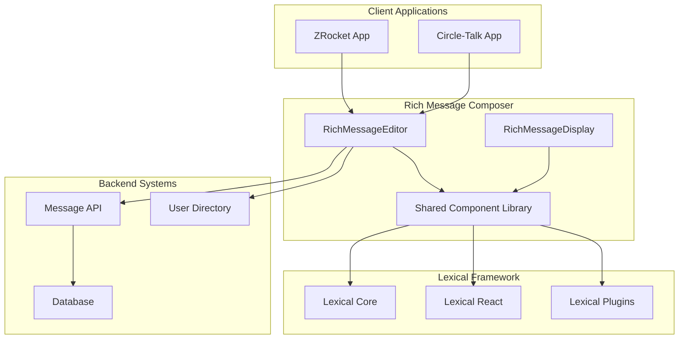
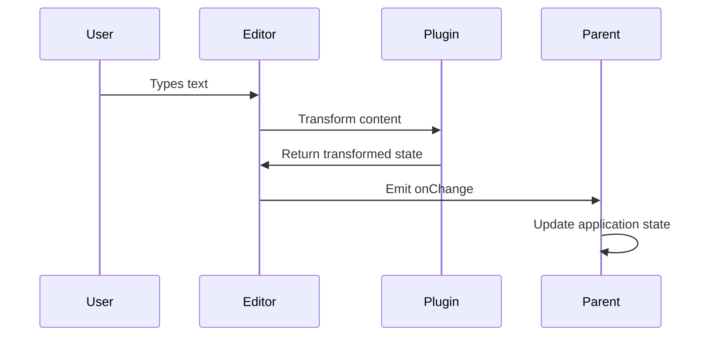
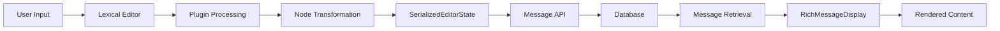

# Technical Architecture Document

# Rich Message Composer - Lexical Integration

**Version**: 1.0.0  
**Date**: January 2025  
**Status**: Draft

---

## 1. Architecture Overview

### 1.1 System Context

The Rich Message Composer integrates Lexical editor framework into existing ZRocket and Circle-Talk applications to replace basic text inputs with sophisticated rich text editing capabilities while maintaining full compatibility with existing message contracts.



### 1.2 Design Principles

1. **Backward Compatibility**: Seamless integration with existing message contracts
2. **Performance First**: Minimal impact on application performance
3. **Accessibility**: WCAG 2.1 AA compliance throughout
4. **Modularity**: Reusable components across applications
5. **Progressive Enhancement**: Rich features enhance but don't replace basic functionality
6. **Security**: Robust input sanitization and XSS prevention

## 2. Component Architecture

### 2.1 High-Level Component Structure

```
rich-message-composer/
├── src/
│   ├── components/          # React components
│   │   ├── RichMessageEditor/
│   │   ├── RichMessageDisplay/
│   │   ├── Toolbar/
│   │   └── Plugins/
│   ├── hooks/              # Custom React hooks
│   ├── utils/              # Utility functions
│   ├── types/              # TypeScript definitions
│   ├── plugins/            # Lexical plugins
│   └── nodes/              # Custom Lexical nodes
└── package.json
```

### 2.2 Core Components

#### 2.2.1 RichMessageEditor

**Purpose**: Main editor component that replaces existing ChatInput
**Responsibilities**:

- Render Lexical editor with configured plugins
- Handle user input and formatting
- Generate SerializedEditorState output
- Manage editor state and lifecycle

```typescript
interface RichMessageEditorProps {
    onSendMessage: (content: SerializedEditorState) => void;
    placeholder?: string;
    initialContent?: SerializedEditorState | string;
    disabled?: boolean;
    maxLength?: number;
    onDraftChange?: (content: SerializedEditorState | null) => void;
    theme?: EditorTheme;
    plugins?: EditorPlugin[];
}
```

#### 2.2.2 RichMessageDisplay

**Purpose**: Read-only component for displaying formatted messages
**Responsibilities**:

- Render SerializedEditorState as formatted content
- Handle interactive elements (links, mentions)
- Support legacy plain text messages
- Maintain consistent styling

```typescript
interface RichMessageDisplayProps {
    content: SerializedEditorState | string;
    className?: string;
    theme?: DisplayTheme;
    onMentionClick?: (userId: string) => void;
    onHashtagClick?: (hashtag: string) => void;
    onLinkClick?: (url: string) => void;
}
```

#### 2.2.3 Toolbar

**Purpose**: Formatting controls for the editor
**Responsibilities**:

- Display available formatting options
- Show active formatting state
- Handle user interactions
- Adapt to different screen sizes

```typescript
interface ToolbarProps {
    editor: LexicalEditor;
    activeFormats: Set<string>;
    disabled?: boolean;
    compact?: boolean;
    customTools?: ToolbarTool[];
}
```

### 2.3 Plugin Architecture

#### 2.3.1 Core Plugins

1. **RichTextPlugin**: Basic rich text functionality
2. **HistoryPlugin**: Undo/redo support
3. **AutoLinkPlugin**: Automatic URL detection
4. **ListPlugin**: Bulleted and numbered lists
5. **OnChangePlugin**: Content change detection

#### 2.3.2 Custom Plugins

1. **MentionsPlugin**: User mention functionality
2. **HashtagPlugin**: Hashtag recognition and formatting
3. **EmojiPlugin**: Emoji picker and shortcode support
4. **ToolbarPlugin**: Dynamic toolbar management
5. **DraftPersistencePlugin**: Auto-save draft content

### 2.4 State Management

#### 2.4.1 Editor State Flow



#### 2.4.2 State Architecture

- **Editor State**: Managed by Lexical framework
- **UI State**: Managed by React components (toolbar, modals)
- **Application State**: Managed by parent applications
- **Draft State**: Persisted in localStorage

## 3. Data Architecture

### 3.1 SerializedEditorState Schema

The editor output must comply with the existing message contract:

```typescript
interface SerializedEditorState {
    root: {
        children: Array<SerializedNode>;
        direction: 'ltr' | 'rtl';
        format: string;
        indent: number;
        type: 'root';
        version: number;
    };
}

interface SerializedNode {
    type: string;
    version: number;
    [key: string]: any; // Node-specific properties
}
```

### 3.2 Custom Node Types

#### 3.2.1 MentionNode

```typescript
interface SerializedMentionNode extends SerializedLexicalNode {
    type: 'mention';
    userId: string;
    username: string;
    displayName: string;
}
```

#### 3.2.2 HashtagNode

```typescript
interface SerializedHashtagNode extends SerializedLexicalNode {
    type: 'hashtag';
    tag: string;
    normalizedTag: string;
}
```

#### 3.2.3 EmojiNode

```typescript
interface SerializedEmojiNode extends SerializedLexicalNode {
    type: 'emoji';
    emoji: string;
    shortcode?: string;
}
```

### 3.3 Data Flow



## 4. Integration Architecture

### 4.1 Application Integration Points

#### 4.1.1 ZRocket Integration

```typescript
// apps/zrocket/app/components/chat/ChatInput.tsx
import { RichMessageEditor } from '@zero/rich-message-composer';

export function ChatInput({ roomId, roomType }: ChatInputProps) {
  const handleSendMessage = (content: SerializedEditorState) => {
    // Send message via Zero mutation
    sendMessage({
      roomId,
      content,
      // ... other fields
    });
  };

  return (
    <RichMessageEditor
      onSendMessage={handleSendMessage}
      placeholder="Type a message..."
    />
  );
}
```

#### 4.1.2 Circle-Talk Integration

```typescript
// apps/circle-talk/src/components/ChatInput.tsx
import { RichMessageEditor } from '@zero/rich-message-composer';

export function ChatInput({ onSendMessage }: ChatInputProps) {
  const handleSendMessage = (content: SerializedEditorState) => {
    // Convert to application format if needed
    const message = {
      id: generateId(),
      content,
      timestamp: new Date(),
      // ... other fields
    };
    onSendMessage(message);
  };

  return (
    <RichMessageEditor
      onSendMessage={handleSendMessage}
      placeholder="Type a message..."
    />
  );
}
```

### 4.2 Shared Library Structure

```typescript
// libs/rich-message-composer/src/index.ts
export { RichMessageEditor } from './components/RichMessageEditor';
export { RichMessageDisplay } from './components/RichMessageDisplay';
export { Toolbar } from './components/Toolbar';

export type {
    RichMessageEditorProps,
    RichMessageDisplayProps,
    EditorTheme,
    ToolbarTool
} from './types';

export {
    useMessageEditor,
    useDraftPersistence,
    useMessageDisplay
} from './hooks';
```

## 5. Performance Architecture

### 5.1 Performance Targets

- **Initial Render**: <100ms
- **Keystroke Latency**: <16ms (60fps)
- **Bundle Size**: <50KB gzipped
- **Memory Usage**: <10MB for typical usage

### 5.2 Optimization Strategies

#### 5.2.1 Code Splitting

```typescript
// Lazy load heavy plugins
const EmojiPlugin = lazy(() => import('./plugins/EmojiPlugin'));
const MentionsPlugin = lazy(() => import('./plugins/MentionsPlugin'));

// Conditional loading based on features used
const useConditionalPlugins = (enabledFeatures: string[]) => {
    return useMemo(() => {
        const plugins = [RichTextPlugin, HistoryPlugin]; // Always loaded

        if (enabledFeatures.includes('mentions')) {
            plugins.push(MentionsPlugin);
        }

        if (enabledFeatures.includes('emoji')) {
            plugins.push(EmojiPlugin);
        }

        return plugins;
    }, [enabledFeatures]);
};
```

#### 5.2.2 Bundle Optimization

```javascript
// webpack.config.js optimization
module.exports = {
    optimization: {
        splitChunks: {
            chunks: 'all',
            cacheGroups: {
                lexical: {
                    test: /[\\/]node_modules[\\/](@lexical|lexical)[\\/]/,
                    name: 'lexical',
                    chunks: 'all'
                }
            }
        }
    }
};
```

#### 5.2.3 Memory Management

```typescript
// Proper cleanup in components
const useEditorCleanup = (editor: LexicalEditor) => {
    useEffect(() => {
        const unregisterListeners: (() => void)[] = [];

        // Register listeners and store cleanup functions
        unregisterListeners.push(
            editor.registerUpdateListener(handleUpdate),
            editor.registerCommand(
                SOME_COMMAND,
                handleCommand,
                COMMAND_PRIORITY_LOW
            )
        );

        return () => {
            // Cleanup all listeners
            unregisterListeners.forEach(cleanup => cleanup());
        };
    }, [editor]);
};
```

## 6. Security Architecture

### 6.1 Input Sanitization

```typescript
// Content sanitization before serialization
const sanitizeContent = (editorState: EditorState): EditorState => {
    return editorState.read(() => {
        const root = $getRoot();
        const sanitized = root.clone();

        // Remove dangerous nodes and attributes
        sanitized.getChildren().forEach(child => {
            if (isUnsafeNode(child)) {
                child.remove();
            }
        });

        return sanitized;
    });
};
```

### 6.2 XSS Prevention

```typescript
// URL validation for links
const validateUrl = (url: string): boolean => {
    const allowedProtocols = ['http:', 'https:', 'mailto:'];
    const blockedProtocols = ['javascript:', 'data:', 'vbscript:'];

    try {
        const parsed = new URL(url);
        return (
            allowedProtocols.includes(parsed.protocol) &&
            !blockedProtocols.includes(parsed.protocol)
        );
    } catch {
        return false;
    }
};
```

### 6.3 Content Security Policy

```typescript
// CSP headers for applications
const cspDirectives = {
    'default-src': ["'self'"],
    'script-src': ["'self'", "'unsafe-inline'"], // Minimize unsafe-inline
    'style-src': ["'self'", "'unsafe-inline'"],
    'img-src': ["'self'", 'data:', 'https:'],
    'connect-src': ["'self'", 'wss:', 'https:'],
    'font-src': ["'self'", 'data:']
};
```

## 7. Testing Architecture

### 7.1 Testing Strategy

#### 7.1.1 Unit Testing

```typescript
// Component testing with React Testing Library
describe('RichMessageEditor', () => {
  it('should emit SerializedEditorState on content change', async () => {
    const onContentChange = jest.fn();
    render(<RichMessageEditor onContentChange={onContentChange} />);

    const editor = screen.getByRole('textbox');
    await user.type(editor, 'Hello world');

    expect(onContentChange).toHaveBeenCalledWith(
      expect.objectContaining({
        root: expect.objectContaining({
          type: 'root'
        })
      })
    );
  });
});
```

#### 7.1.2 Integration Testing

```typescript
// Plugin integration testing
describe('MentionsPlugin', () => {
  it('should create mention node when selecting user', async () => {
    const users = [{ id: '1', username: 'john', displayName: 'John Doe' }];
    render(<RichMessageEditor mentionUsers={users} />);

    await user.type(screen.getByRole('textbox'), '@jo');
    await user.click(screen.getByText('John Doe'));

    const editorState = getEditorState();
    expect(editorState).toContainNode('mention');
  });
});
```

#### 7.1.3 E2E Testing

```typescript
// End-to-end testing with Playwright
test('should send formatted message successfully', async ({ page }) => {
    await page.goto('/chat/room/123');

    // Type and format message
    await page.fill('[data-testid="message-editor"]', 'Hello world');
    await page.keyboard.press('Control+A');
    await page.click('[data-testid="bold-button"]');

    // Send message
    await page.click('[data-testid="send-button"]');

    // Verify message appears formatted
    await expect(
        page.locator('[data-testid="message-content"] strong')
    ).toHaveText('Hello world');
});
```

### 7.2 Performance Testing

```typescript
// Performance benchmarking
const performanceTest = async () => {
    const start = performance.now();

    // Simulate typing 1000 characters
    for (let i = 0; i < 1000; i++) {
        await typeCharacter('a');
    }

    const end = performance.now();
    const avgLatency = (end - start) / 1000;

    expect(avgLatency).toBeLessThan(16); // 60fps requirement
};
```

## 8. Deployment Architecture

### 8.1 Build Pipeline

```yaml
# .github/workflows/build.yml
name: Build and Test
on: [push, pull_request]

jobs:
    build:
        runs-on: ubuntu-latest
        steps:
            - uses: actions/checkout@v3
            - uses: actions/setup-node@v3
            - run: npm ci
            - run: npm run build
            - run: npm run test
            - run: npm run e2e
            - run: npm run bundle-analysis
```

### 8.2 Package Distribution

```json
{
    "name": "@zero/rich-message-composer",
    "version": "1.0.0",
    "main": "dist/index.js",
    "module": "dist/index.esm.js",
    "types": "dist/index.d.ts",
    "files": ["dist"],
    "peerDependencies": {
        "react": ">=16.8.0",
        "lexical": ">=0.22.0"
    }
}
```

### 8.3 Monitoring and Observability

```typescript
// Performance monitoring
const reportPerformanceMetrics = (metrics: PerformanceMetrics) => {
    // Report to monitoring service
    analytics.track('editor_performance', {
        renderTime: metrics.renderTime,
        keystrokeLatency: metrics.keystrokeLatency,
        memoryUsage: metrics.memoryUsage,
        bundleSize: metrics.bundleSize
    });
};

// Error tracking
const reportError = (error: Error, context: ErrorContext) => {
    errorTracker.captureException(error, {
        tags: {
            component: context.component,
            plugin: context.plugin,
            browser: context.browser
        },
        extra: context.additionalData
    });
};
```

## 9. Migration Strategy

### 9.1 Backward Compatibility

```typescript
// Support for existing plain text messages
const normalizeContent = (
    content: string | SerializedEditorState
): SerializedEditorState => {
    if (typeof content === 'string') {
        // Convert plain text to SerializedEditorState
        return createEmptyEditorState()
            .update(() => {
                const root = $getRoot();
                const paragraph = $createParagraphNode();
                paragraph.append($createTextNode(content));
                root.append(paragraph);
            })
            .toJSON();
    }
    return content;
};
```

### 9.2 Gradual Rollout

```typescript
// Feature flag implementation
const useFeatureFlag = (flag: string) => {
  return useContext(FeatureFlagContext)[flag] ?? false;
};

const ChatInput = (props: ChatInputProps) => {
  const useRichEditor = useFeatureFlag('rich-message-composer');

  return useRichEditor ? (
    <RichMessageEditor {...props} />
  ) : (
    <LegacyChatInput {...props} />
  );
};
```

---

**Document Status**: Draft  
**Next Review**: End of Epic E001  
**Stakeholders**: Engineering Team, Architecture Review Board  
**Dependencies**: Lexical Framework Documentation, Message Contract Specifications
