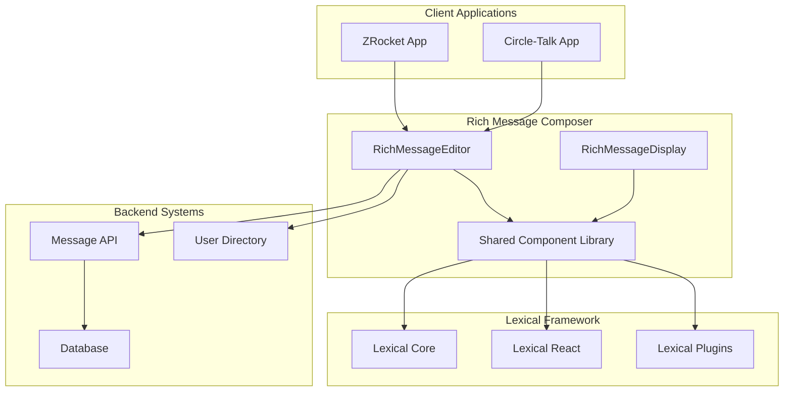
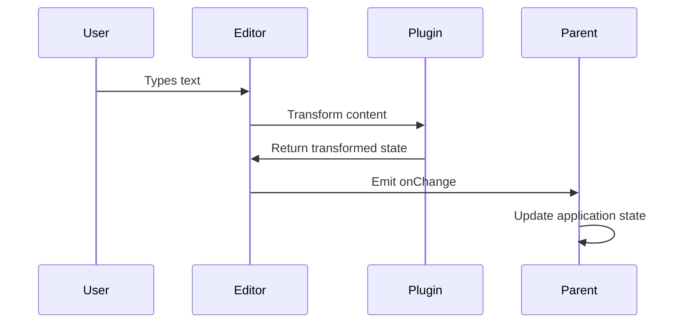
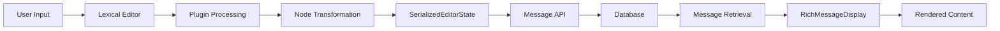
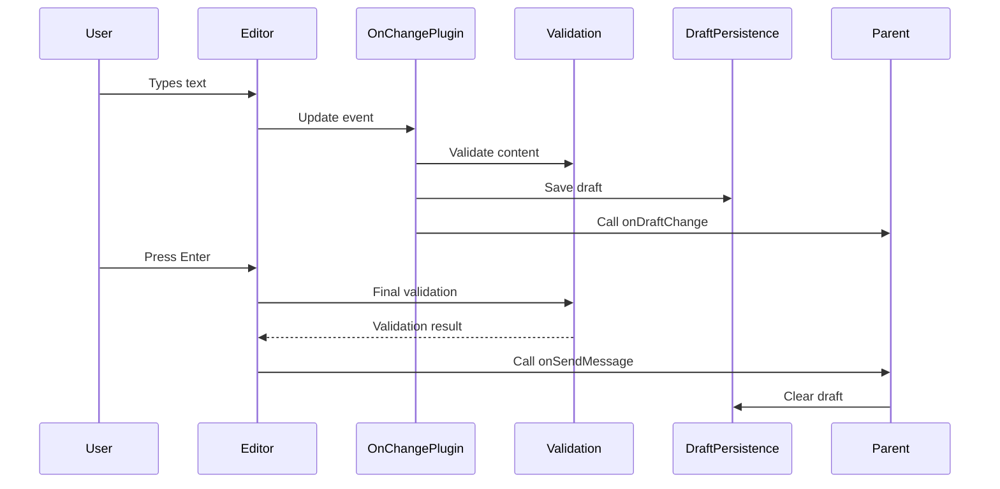

# Comprehensive Technical Architecture Document

# Rich Message Composer - Lexical Integration

**Project**: Rich Message Composer  
**Version**: 1.0.0  
**Date**: January 2025  
**Status**: Draft  
**Document Type**: Consolidated Technical Architecture

---

## 1. Architecture Overview

### 1.1 System Context

The Rich Message Composer integrates Lexical editor framework into existing ZRocket and Circle-Talk applications to replace basic text inputs with sophisticated rich text editing capabilities while maintaining full compatibility with existing message contracts.



### 1.2 Design Principles

1. **Backward Compatibility**: Seamless integration with existing message contracts
2. **Performance First**: Minimal impact on application performance
3. **Accessibility**: WCAG 2.1 AA compliance throughout
4. **Modularity**: Reusable components across applications
5. **Progressive Enhancement**: Rich features enhance but don't replace basic functionality
6. **Security**: Robust input sanitization and XSS prevention

## 2. Component Architecture

### 2.1 High-Level Component Structure

```
rich-message-composer/
├── src/
│   ├── components/          # React components
│   │   ├── RichMessageEditor/
│   │   ├── RichMessageDisplay/
│   │   ├── Toolbar/
│   │   └── Plugins/
│   ├── hooks/              # Custom React hooks
│   ├── utils/              # Utility functions
│   ├── types/              # TypeScript definitions
│   ├── plugins/            # Lexical plugins
│   └── nodes/              # Custom Lexical nodes
└── package.json
```

### 2.2 Component Hierarchy

```
ChatInput (existing)
├── RichMessageEditor (new)
│   ├── LexicalComposer
│   │   ├── RichTextPlugin
│   │   ├── HistoryPlugin
│   │   ├── AutoLinkPlugin
│   │   ├── ListPlugin
│   │   ├── OnChangePlugin
│   │   ├── MentionsPlugin (custom)
│   │   ├── ToolbarPlugin (custom)
│   │   ├── DraftPersistencePlugin (custom)
│   │   └── ValidationPlugin (custom)
│   ├── ErrorBoundary
│   └── AccessibilityProvider
├── AttachmentButton (existing)
├── EmojiButton (existing)
└── SendButton (existing)
```

### 2.3 Core Components

#### 2.3.1 RichMessageEditor Component

**Primary Responsibilities:**

- Manage Lexical editor instance and configuration
- Handle serialization to/from `SerializedEditorState`
- Provide interface for parent components
- Manage editor state and validation

**Interface:**

```typescript
interface RichMessageEditorProps {
    onSendMessage: (content: SerializedEditorState) => void;
    placeholder?: string;
    initialContent?: SerializedEditorState | string;
    onDraftChange?: (content: SerializedEditorState | null) => void;
    disabled?: boolean;
    maxLength?: number;
    autoFocus?: boolean;
    theme?: EditorTheme;
    plugins?: EditorPlugin[];
}

interface RichMessageEditorRef {
    focus: () => void;
    clear: () => void;
    insertText: (text: string) => void;
    getContent: () => SerializedEditorState | null;
    setContent: (content: SerializedEditorState) => void;
}
```

#### 2.3.2 RichMessageDisplay

**Purpose**: Read-only component for displaying formatted messages
**Responsibilities**:

- Render SerializedEditorState as formatted content
- Handle interactive elements (links, mentions)
- Support legacy plain text messages
- Maintain consistent styling

```typescript
interface RichMessageDisplayProps {
    content: SerializedEditorState | string;
    className?: string;
    theme?: DisplayTheme;
    onMentionClick?: (userId: string) => void;
    onHashtagClick?: (hashtag: string) => void;
    onLinkClick?: (url: string) => void;
}
```

#### 2.3.3 Toolbar

**Purpose**: Formatting controls for the editor
**Responsibilities**:

- Display available formatting options
- Show active formatting state
- Handle user interactions
- Adapt to different screen sizes

```typescript
interface ToolbarProps {
    editor: LexicalEditor;
    activeFormats: Set<string>;
    disabled?: boolean;
    compact?: boolean;
    customTools?: ToolbarTool[];
}
```

### 2.4 Lexical Configuration

**Initial Config:**

```typescript
const initialConfig: InitialConfigType = {
    namespace: 'RichMessageEditor',
    theme: messageEditorTheme,
    onError: handleEditorError,
    nodes: [
        // Core nodes
        HeadingNode,
        ListNode,
        ListItemNode,
        QuoteNode,
        CodeNode,
        CodeHighlightNode,
        TableNode,
        TableCellNode,
        TableRowNode,
        HashtagNode,
        AutoLinkNode,
        LinkNode,
        // Custom nodes
        MentionNode,
        EmojiNode
    ],
    editorState: initialEditorState
};
```

**Theme Configuration:**

```typescript
const messageEditorTheme: EditorThemeClasses = {
    paragraph: 'editor-paragraph',
    text: {
        bold: 'editor-text-bold',
        italic: 'editor-text-italic',
        underline: 'editor-text-underline',
        strikethrough: 'editor-text-strikethrough',
        code: 'editor-text-code'
    },
    link: 'editor-link',
    list: {
        nested: {
            listitem: 'editor-nested-listitem'
        },
        ol: 'editor-list-ol',
        ul: 'editor-list-ul',
        listitem: 'editor-listitem'
    },
    // Custom theme classes
    mention: 'editor-mention',
    emoji: 'editor-emoji'
};
```

### 2.5 Plugin Architecture

#### 2.5.1 Core Plugins (From Lexical)

1. **RichTextPlugin**: Basic rich text functionality
2. **HistoryPlugin**: Undo/redo support
3. **AutoLinkPlugin**: Automatic URL detection
4. **ListPlugin**: Bulleted and numbered lists
5. **OnChangePlugin**: Content change detection

#### RichTextPlugin

- **Purpose**: Provides basic rich text editing capabilities
- **Features**: Bold, italic, underline, strikethrough, copy/paste
- **Configuration**: Standard configuration with custom theme

#### HistoryPlugin

- **Purpose**: Undo/redo functionality
- **Features**: Command-based history with keyboard shortcuts
- **Configuration**: Standard with custom delay settings

#### AutoLinkPlugin

- **Purpose**: Automatic URL detection and linking
- **Features**: Real-time URL detection, click to open
- **Configuration**:

```typescript
const URL_MATCHER =
    /((https?:\/\/(www\.)?)|(www\.))[-a-zA-Z0-9@:%._+~#=]{1,256}\.[a-zA-Z0-9()]{1,6}\b([-a-zA-Z0-9()@:%_+.~#?&//=]*)/;

const MATCHERS = [
    (text: string) => {
        const match = URL_MATCHER.exec(text);
        if (match === null) return null;
        const fullMatch = match[0];
        return {
            index: match.index,
            length: fullMatch.length,
            text: fullMatch,
            url: fullMatch.startsWith('http')
                ? fullMatch
                : `https://${fullMatch}`,
            attributes: { rel: 'noreferrer', target: '_blank' }
        };
    }
];
```

#### ListPlugin

- **Purpose**: Support for ordered and unordered lists
- **Features**: Nested lists, keyboard shortcuts, conversion
- **Configuration**: Standard configuration

#### OnChangePlugin

- **Purpose**: React to editor state changes
- **Features**: Serialization, validation, draft persistence
- **Implementation**:

```typescript
function OnChangePlugin({
    onChange
}: {
    onChange: (editorState: EditorState) => void;
}) {
    const [editor] = useLexicalComposerContext();

    useEffect(() => {
        return editor.registerUpdateListener(({ editorState }) => {
            onChange(editorState);
        });
    }, [editor, onChange]);

    return null;
}
```

#### 2.5.2 Custom Plugins

1. **MentionsPlugin**: User mention functionality
2. **HashtagPlugin**: Hashtag recognition and formatting
3. **EmojiPlugin**: Emoji picker and shortcode support
4. **ToolbarPlugin**: Dynamic toolbar management
5. **DraftPersistencePlugin**: Auto-save draft content

#### MentionsPlugin

- **Purpose**: Handle @username mentions with autocomplete
- **Features**:
    - Trigger on @ character
    - Autocomplete dropdown with user search
    - Keyboard navigation
    - Mention node creation
- **Implementation Strategy**:

```typescript
class MentionNode extends TextNode {
    static getType(): string {
        return 'mention';
    }

    static clone(node: MentionNode): MentionNode {
        return new MentionNode(node.__mention, node.__text, node.__key);
    }

    constructor(mention: UserMention, text?: string, key?: NodeKey) {
        super(text ?? `@${mention.username}`, key);
        this.__mention = mention;
    }

    createDOM(): HTMLElement {
        const element = super.createDOM();
        element.className = 'editor-mention';
        element.setAttribute('data-mention-id', this.__mention.id);
        return element;
    }

    static importJSON(serializedNode: SerializedMentionNode): MentionNode {
        const { mention, text } = serializedNode;
        return $createMentionNode(mention, text);
    }

    exportJSON(): SerializedMentionNode {
        return {
            ...super.exportJSON(),
            mention: this.__mention,
            type: 'mention',
            version: 1
        };
    }
}
```

#### ToolbarPlugin

- **Purpose**: Floating toolbar for text formatting
- **Features**:
    - Appears on text selection
    - Bold, italic, link, list buttons
    - Keyboard accessible
    - Position calculation
- **Implementation Strategy**:

```typescript
function ToolbarPlugin(): JSX.Element {
  const [editor] = useLexicalComposerContext();
  const [isVisible, setIsVisible] = useState(false);
  const [position, setPosition] = useState({ top: 0, left: 0 });

  useEffect(() => {
    return editor.registerUpdateListener(({ editorState }) => {
      editorState.read(() => {
        const selection = $getSelection();
        if ($isRangeSelection(selection) && !selection.isCollapsed()) {
          const domSelection = getDOMSelection();
          if (domSelection && domSelection.rangeCount > 0) {
            const range = domSelection.getRangeAt(0);
            const rect = range.getBoundingClientRect();
            setPosition({ top: rect.top - 40, left: rect.left });
            setIsVisible(true);
          }
        } else {
          setIsVisible(false);
        }
      });
    });
  }, [editor]);

  return isVisible ? (
    <Portal>
      <div className="toolbar" style={{ top: position.top, left: position.left }}>
        {/* Toolbar buttons */}
      </div>
    </Portal>
  ) : null;
}
```

#### DraftPersistencePlugin

- **Purpose**: Auto-save draft content to localStorage
- **Features**:
    - Automatic save on content change
    - Restore on component mount
    - Clear on message send
- **Implementation Strategy**:

```typescript
function DraftPersistencePlugin({ roomId }: { roomId: string }) {
    const [editor] = useLexicalComposerContext();
    const draftKey = `message-draft-${roomId}`;

    useEffect(() => {
        // Restore draft on mount
        const savedDraft = localStorage.getItem(draftKey);
        if (savedDraft) {
            try {
                const editorState = editor.parseEditorState(savedDraft);
                editor.setEditorState(editorState);
            } catch (error) {
                console.warn('Failed to restore draft:', error);
                localStorage.removeItem(draftKey);
            }
        }
    }, [editor, draftKey]);

    useEffect(() => {
        // Save draft on change
        return editor.registerUpdateListener(({ editorState }) => {
            const serialized = JSON.stringify(editorState.toJSON());
            localStorage.setItem(draftKey, serialized);
        });
    }, [editor, draftKey]);

    return null;
}
```

#### ValidationPlugin

- **Purpose**: Content validation before sending
- **Features**:
    - Length validation
    - Content sanitization
    - Error reporting
- **Implementation Strategy**:

```typescript
function ValidationPlugin({
    maxLength,
    onValidationChange
}: {
    maxLength: number;
    onValidationChange: (isValid: boolean, errors: string[]) => void;
}) {
    const [editor] = useLexicalComposerContext();

    useEffect(() => {
        return editor.registerUpdateListener(({ editorState }) => {
            editorState.read(() => {
                const errors: string[] = [];
                const textContent = $getRoot().getTextContent();

                if (textContent.length > maxLength) {
                    errors.push(
                        `Message too long (${textContent.length}/${maxLength})`
                    );
                }

                // Additional validation rules

                onValidationChange(errors.length === 0, errors);
            });
        });
    }, [editor, maxLength, onValidationChange]);

    return null;
}
```

### 2.6 State Management

#### 2.6.1 Editor State Flow



#### 2.6.2 State Architecture

- **Editor State**: Managed by Lexical framework
- **UI State**: Managed by React components (toolbar, modals)
- **Application State**: Managed by parent applications
- **Draft State**: Persisted in localStorage

## 3. Data Architecture & Flow

### 3.1 SerializedEditorState Schema

The editor output must comply with the existing message contract:

```typescript
interface SerializedEditorState {
    root: {
        children: Array<SerializedNode>;
        direction: 'ltr' | 'rtl';
        format: string;
        indent: number;
        type: 'root';
        version: number;
    };
}

interface SerializedNode {
    type: string;
    version: number;
    [key: string]: any; // Node-specific properties
}
```

### 3.2 Custom Node Types

#### 3.2.1 MentionNode

```typescript
interface SerializedMentionNode extends SerializedLexicalNode {
    type: 'mention';
    userId: string;
    username: string;
    displayName: string;
}
```

#### 3.2.2 HashtagNode

```typescript
interface SerializedHashtagNode extends SerializedLexicalNode {
    type: 'hashtag';
    tag: string;
    normalizedTag: string;
}
```

#### 3.2.3 EmojiNode

```typescript
interface SerializedEmojiNode extends SerializedLexicalNode {
    type: 'emoji';
    emoji: string;
    shortcode?: string;
}
```

### 3.3 Data Flow



### 3.4 Editor State Management



### 3.5 Serialization Strategy

**Input Flow:**

1. User types/edits content in Lexical editor
2. Lexical maintains internal EditorState
3. OnChangePlugin triggers on state changes
4. EditorState.toJSON() generates SerializedEditorState
5. Content validated and saved as draft
6. On send, final SerializedEditorState passed to parent

**Output Flow:**

1. Parent provides SerializedEditorState as prop
2. editor.parseEditorState() converts to internal state
3. Lexical renders content in editor
4. User can continue editing from restored state

### 3.6 Error Handling Strategy

```typescript
interface ErrorHandlingStrategy {
    // Editor initialization errors
    onEditorError: (error: Error) => void;

    // Serialization/deserialization errors
    onSerializationError: (error: Error, content: unknown) => void;

    // Plugin errors
    onPluginError: (pluginName: string, error: Error) => void;

    // Validation errors
    onValidationError: (errors: ValidationError[]) => void;

    // Recovery strategies
    fallbackToPlainText: (content: string) => void;
    clearCorruptedState: () => void;
}
```

## 4. Integration Architecture

### 4.1 Application Integration Points

#### 4.1.1 ZRocket Integration

```typescript
// apps/zrocket/app/components/chat/ChatInput.tsx
import { RichMessageEditor } from '@zero/rich-message-composer';

export function ChatInput({ roomId, roomType }: ChatInputProps) {
  const handleSendMessage = (content: SerializedEditorState) => {
    // Send message via Zero mutation
    sendMessage({
      roomId,
      content,
      // ... other fields
    });
  };

  return (
    <RichMessageEditor
      onSendMessage={handleSendMessage}
      placeholder="Type a message..."
    />
  );
}
```

#### 4.1.2 Circle-Talk Integration

```typescript
// apps/circle-talk/src/components/ChatInput.tsx
import { RichMessageEditor } from '@zero/rich-message-composer';

export function ChatInput({ onSendMessage }: ChatInputProps) {
  const handleSendMessage = (content: SerializedEditorState) => {
    // Convert to application format if needed
    const message = {
      id: generateId(),
      content,
      timestamp: new Date(),
      // ... other fields
    };
    onSendMessage(message);
  };

  return (
    <RichMessageEditor
      onSendMessage={handleSendMessage}
      placeholder="Type a message..."
    />
  );
}
```

### 4.2 Shared Library Structure

```typescript
// libs/rich-message-composer/src/index.ts
export { RichMessageEditor } from './components/RichMessageEditor';
export { RichMessageDisplay } from './components/RichMessageDisplay';
export { Toolbar } from './components/Toolbar';

export type {
    RichMessageEditorProps,
    RichMessageDisplayProps,
    EditorTheme,
    ToolbarTool
} from './types';

export {
    useMessageEditor,
    useDraftPersistence,
    useMessageDisplay
} from './hooks';
```

## 5. Performance Architecture

### 5.1 Performance Targets

- **Initial Render**: <100ms
- **Keystroke Latency**: <16ms (60fps)
- **Bundle Size**: <50KB gzipped
- **Memory Usage**: <10MB for typical usage

### 5.2 Bundle Optimization

**Code Splitting Strategy:**

- Core editor loaded immediately
- Advanced plugins loaded lazily
- Custom plugins in separate chunks
- Theme and styling optimized

**Bundle Analysis:**

```
Core Bundle (~22KB):
├── lexical (core)
├── @lexical/react
├── RichTextPlugin
├── HistoryPlugin
└── OnChangePlugin

Extended Bundle (~15KB):
├── AutoLinkPlugin
├── ListPlugin
├── MentionsPlugin
└── ToolbarPlugin

Advanced Bundle (~10KB):
├── TablePlugin
├── CodeHighlightPlugin
└── Future plugins
```

### 5.3 Optimization Strategies

#### 5.3.1 Code Splitting

```typescript
// Lazy load heavy plugins
const EmojiPlugin = lazy(() => import('./plugins/EmojiPlugin'));
const MentionsPlugin = lazy(() => import('./plugins/MentionsPlugin'));

// Conditional loading based on features used
const useConditionalPlugins = (enabledFeatures: string[]) => {
    return useMemo(() => {
        const plugins = [RichTextPlugin, HistoryPlugin]; // Always loaded

        if (enabledFeatures.includes('mentions')) {
            plugins.push(MentionsPlugin);
        }

        if (enabledFeatures.includes('emoji')) {
            plugins.push(EmojiPlugin);
        }

        return plugins;
    }, [enabledFeatures]);
};
```

#### 5.3.2 Bundle Optimization

```javascript
// webpack.config.js optimization
module.exports = {
    optimization: {
        splitChunks: {
            chunks: 'all',
            cacheGroups: {
                lexical: {
                    test: /[\\/]node_modules[\\/](@lexical|lexical)[\\/]/,
                    name: 'lexical',
                    chunks: 'all'
                }
            }
        }
    }
};
```

#### 5.3.3 React Optimization

```typescript
// Memoized components
const RichMessageEditor = memo(
    forwardRef<RichMessageEditorRef, RichMessageEditorProps>(
        ({ onSendMessage, placeholder, initialContent, ...props }, ref) => {
            // Implementation
        }
    )
);

// Debounced change handlers
const debouncedOnChange = useMemo(
    () =>
        debounce((editorState: EditorState) => {
            // Handle change
        }, 300),
    [dependencies]
);

// Lazy plugin loading
const MentionsPlugin = lazy(() => import('./plugins/MentionsPlugin'));
```

**Lexical Optimization:**

- Use editor.update() for batch operations
- Avoid unnecessary re-renders with proper memoization
- Optimize node transforms and listeners
- Implement efficient selection handling

### 5.4 Memory Management

**Strategy:**

- Proper cleanup of event listeners
- Dispose of editor instances on unmount
- Clear draft data when appropriate
- Optimize large document handling

```typescript
// Proper cleanup in components
const useEditorCleanup = (editor: LexicalEditor) => {
    useEffect(() => {
        const unregisterListeners: (() => void)[] = [];

        // Register listeners and store cleanup functions
        unregisterListeners.push(
            editor.registerUpdateListener(handleUpdate),
            editor.registerCommand(
                SOME_COMMAND,
                handleCommand,
                COMMAND_PRIORITY_LOW
            )
        );

        return () => {
            // Cleanup all listeners
            unregisterListeners.forEach(cleanup => cleanup());
        };
    }, [editor]);
};
```

## 6. Security Architecture

### 6.1 Input Sanitization

```typescript
// Content sanitization before serialization
const sanitizeContent = (editorState: EditorState): EditorState => {
    return editorState.read(() => {
        const root = $getRoot();
        const sanitized = root.clone();

        // Remove dangerous nodes and attributes
        sanitized.getChildren().forEach(child => {
            if (isUnsafeNode(child)) {
                child.remove();
            }
        });

        return sanitized;
    });
};
```

### 6.2 XSS Prevention

```typescript
// URL validation for links
const validateUrl = (url: string): boolean => {
    const allowedProtocols = ['http:', 'https:', 'mailto:'];
    const blockedProtocols = ['javascript:', 'data:', 'vbscript:'];

    try {
        const parsed = new URL(url);
        return (
            allowedProtocols.includes(parsed.protocol) &&
            !blockedProtocols.includes(parsed.protocol)
        );
    } catch {
        return false;
    }
};
```

### 6.3 Content Security Policy

```typescript
// CSP headers for applications
const cspDirectives = {
    'default-src': ["'self'"],
    'script-src': ["'self'", "'unsafe-inline'"], // Minimize unsafe-inline
    'style-src': ["'self'", "'unsafe-inline'"],
    'img-src': ["'self'", 'data:', 'https:'],
    'connect-src': ["'self'", 'wss:', 'https:'],
    'font-src': ["'self'", 'data:']
};
```

## 7. Testing Architecture

### 7.1 Testing Strategy

#### 7.1.1 Unit Testing

```typescript
## 7. Testing Architecture

### 7.1 Testing Strategy

#### 7.1.1 Unit Testing

```typescript
// Component testing with React Testing Library
describe('RichMessageEditor', () => {
  it('should emit SerializedEditorState on content change', async () => {
    const onContentChange = jest.fn();
    render(<RichMessageEditor onContentChange={onContentChange} />);

    const editor = screen.getByRole('textbox');
    await user.type(editor, 'Hello world');

    expect(onContentChange).toHaveBeenCalledWith(
      expect.objectContaining({
        root: expect.objectContaining({
          type: 'root'
        })
      })
    );
  });
});
```

#### 7.1.2 Integration Testing

```typescript
// Plugin integration testing
describe('MentionsPlugin', () => {
  it('should create mention node when selecting user', async () => {
    const users = [{ id: '1', username: 'john', displayName: 'John Doe' }];
    render(<RichMessageEditor mentionUsers={users} />);

    await user.type(screen.getByRole('textbox'), '@jo');
    await user.click(screen.getByText('John Doe'));

    const editorState = getEditorState();
    expect(editorState).toContainNode('mention');
  });
});
```

#### 7.1.3 E2E Testing

```typescript
// End-to-end testing with Playwright
test('should send formatted message successfully', async ({ page }) => {
    // Navigate to a public channel (correct route format: /c/:channelId)
    await page.goto('/c/test-channel');

    // Type and format message
    await page.fill('[data-testid="message-editor"]', 'Hello world');
    await page.keyboard.press('Control+A');
    await page.click('[data-testid="bold-button"]');

    // Send message
    await page.click('[data-testid="send-button"]');

    // Verify message appears formatted
    await expect(
        page.locator('[data-testid="message-content"] strong')
    ).toHaveText('Hello world');
});
```

### 7.2 Unit Testing Strategy

**Test Structure:**

```
tests/
├── components/
│   ├── RichMessageEditor.test.tsx
│   └── __mocks__/
├── plugins/
│   ├── MentionsPlugin.test.ts
│   ├── ToolbarPlugin.test.tsx
│   └── ValidationPlugin.test.ts
├── utils/
│   ├── serialization.test.ts
│   └── validation.test.ts
└── integration/
    ├── editor-flow.test.tsx
    └── message-sending.test.tsx
```

**Key Test Areas:**

- Editor initialization and configuration
- Plugin functionality and interactions
- Serialization/deserialization accuracy
- User interaction flows
- Error handling and recovery
- Performance and memory usage

### 7.3 Integration Testing

**Test Scenarios:**

- Complete message composition and sending flow
- Draft persistence and restoration
- Mention system with user directory
- Toolbar interaction and formatting
- Keyboard shortcuts and accessibility
- Cross-browser compatibility

### 7.4 E2E Testing Strategy

**Critical User Journeys:**

1. Plain text message composition and sending
2. Rich text formatting application
3. Mention usage with autocomplete
4. Link insertion and validation
5. List creation and management
6. Draft saving and restoration
7. Error recovery scenarios

### 7.5 Performance Testing

```typescript
// Performance benchmarking
const performanceTest = async () => {
    const start = performance.now();

    // Simulate typing 1000 characters
    for (let i = 0; i < 1000; i++) {
        await typeCharacter('a');
    }

    const end = performance.now();
    const avgLatency = (end - start) / 1000;

    expect(avgLatency).toBeLessThan(16); // 60fps requirement
};
```
```

#### 7.1.2 Integration Testing

```typescript
// Plugin integration testing
describe('MentionsPlugin', () => {
  it('should create mention node when selecting user', async () => {
    const users = [{ id: '1', username: 'john', displayName: 'John Doe' }];
    render(<RichMessageEditor mentionUsers={users} />);

    await user.type(screen.getByRole('textbox'), '@jo');
    await user.click(screen.getByText('John Doe'));

    const editorState = getEditorState();
    expect(editorState).toContainNode('mention');
  });
});
```

#### 7.1.3 E2E Testing

```typescript
// End-to-end testing with Playwright
test('should send formatted message successfully', async ({ page }) => {
    // Navigate to a public channel (correct route format: /c/:channelId)
    await page.goto('/c/test-channel');

    // Type and format message
    await page.fill('[data-testid="message-editor"]', 'Hello world');
    await page.keyboard.press('Control+A');
    await page.click('[data-testid="bold-button"]');

    // Send message
    await page.click('[data-testid="send-button"]');

    // Verify message appears formatted
    await expect(
        page.locator('[data-testid="message-content"] strong')
    ).toHaveText('Hello world');
});
```

### 7.2 Performance Testing

```typescript
// Performance benchmarking
const performanceTest = async () => {
    const start = performance.now();

    // Simulate typing 1000 characters
    for (let i = 0; i < 1000; i++) {
        await typeCharacter('a');
    }

    const end = performance.now();
    const avgLatency = (end - start) / 1000;

    expect(avgLatency).toBeLessThan(16); // 60fps requirement
};
```

## 8. Deployment Architecture

### 8.1 Build Pipeline

```yaml
# .github/workflows/build.yml
name: Build and Test
on: [push, pull_request]

jobs:
    build:
        runs-on: ubuntu-latest
        steps:
            - uses: actions/checkout@v3
            - uses: actions/setup-node@v3
            - run: npm ci
            - run: npm run build
            - run: npm run test
            - run: npm run e2e
            - run: npm run bundle-analysis
```

### 8.2 Package Distribution

```json
{
    "name": "@zero/rich-message-composer",
    "version": "1.0.0",
    "main": "dist/index.js",
    "module": "dist/index.esm.js",
    "types": "dist/index.d.ts",
    "files": ["dist"],
    "peerDependencies": {
        "react": ">=16.8.0",
        "lexical": ">=0.22.0"
    }
}
```

### 8.3 Monitoring and Observability

```typescript
// Performance monitoring
const reportPerformanceMetrics = (metrics: PerformanceMetrics) => {
    // Report to monitoring service
    analytics.track('editor_performance', {
        renderTime: metrics.renderTime,
        keystrokeLatency: metrics.keystrokeLatency,
        memoryUsage: metrics.memoryUsage,
        bundleSize: metrics.bundleSize
    });
};

// Error tracking
const reportError = (error: Error, context: ErrorContext) => {
    errorTracker.captureException(error, {
        tags: {
            component: context.component,
            plugin: context.plugin,
            browser: context.browser
        },
        extra: context.additionalData
    });
};
```

## 9. Migration Strategy

### 9.1 Backward Compatibility

```typescript
// Support for existing plain text messages
const normalizeContent = (
    content: string | SerializedEditorState
): SerializedEditorState => {
    if (typeof content === 'string') {
        // Convert plain text to SerializedEditorState
        return createEmptyEditorState()
            .update(() => {
                const root = $getRoot();
                const paragraph = $createParagraphNode();
                paragraph.append($createTextNode(content));
                root.append(paragraph);
            })
            .toJSON();
    }
    return content;
};
```

### 9.2 Gradual Rollout

```typescript
// Feature flag implementation
const useFeatureFlag = (flag: string) => {
  return useContext(FeatureFlagContext)[flag] ?? false;
};

const ChatInput = (props: ChatInputProps) => {
  const useRichEditor = useFeatureFlag('rich-message-composer');

  return useRichEditor ? (
    <RichMessageEditor {...props} />
  ) : (
    <LegacyChatInput {...props} />
  );
};
```

## 10. Security Architecture

### 10.1 Input Sanitization

**Sanitization Pipeline:**

```typescript
interface ContentSanitizer {
    // Remove malicious HTML/scripts
    sanitizeHTML: (html: string) => string;

    // Validate and sanitize URLs
    sanitizeURLs: (url: string) => string | null;

    // Validate mention references
    validateMentions: (mentions: MentionNode[]) => MentionNode[];

    // Content length and format validation
    validateContent: (content: SerializedEditorState) => ValidationResult;
}
```

**Output Sanitization:**

- All URLs validated before link creation
- Mention IDs verified against authorized users
- HTML content stripped of dangerous elements
- Script execution prevention

### 10.2 XSS Prevention

**Prevention Strategies:**

- Content Security Policy enforcement
- HTML sanitization with DOMPurify
- URL validation and whitelisting
- Mention reference validation
- Output encoding for all user content

### 10.3 Data Privacy

**Privacy Measures:**

- Draft data stored locally only
- No external service calls for processing
- User mention privacy respect
- Content logging limitations

## 11. Documentation & Training

### 11.1 Technical Documentation

**Developer Documentation:**

- Architecture overview and design decisions
- Plugin development guide
- Testing strategies and examples
- Performance optimization guidelines
- Troubleshooting and debugging guide

### 11.2 User Documentation

**End User Training:**

- Rich text feature overview
- Keyboard shortcuts reference
- Mention system usage
- Accessibility features guide

## 12. Future Considerations

### 12.1 Extensibility

**Plugin System:**

- Well-defined plugin interfaces
- Third-party plugin support
- Configuration-driven feature enabling
- Custom node type support

### 12.2 Advanced Features

**Future Enhancements:**

- Real-time collaborative editing
- Advanced media embedding
- Custom emoji reactions
- Message threading support
- Voice message integration

### 12.3 Performance Evolution

**Optimization Roadmap:**

- Virtual scrolling for large messages
- Advanced caching strategies
- WebAssembly integration considerations
- Progressive loading optimization

---

**Document Status**: Draft  
**Next Review**: End of Epic E001  
**Stakeholders**: Engineering Team, Architecture Review Board  
**Dependencies**: Lexical Framework Documentation, Message Contract Specifications
