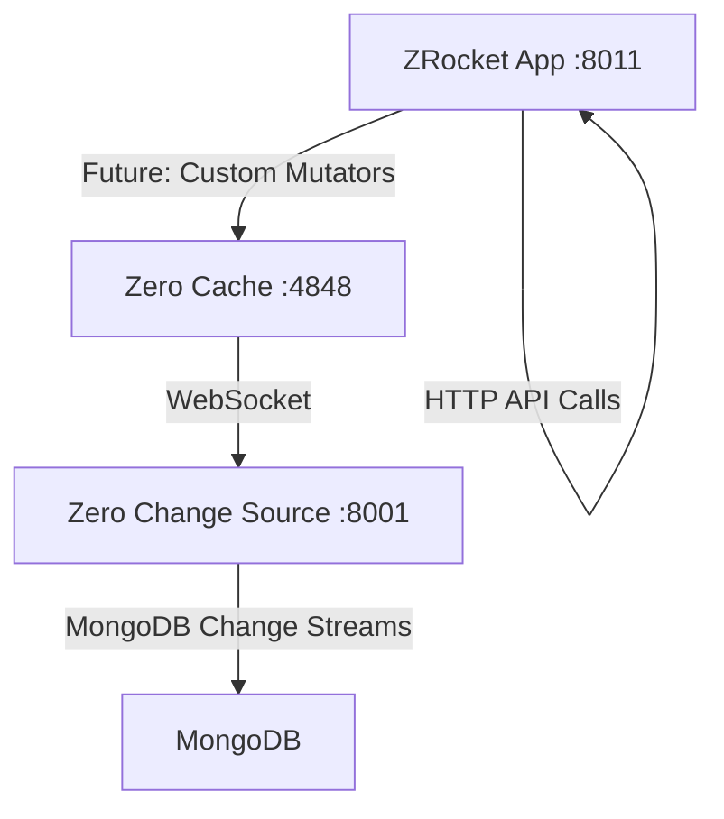

# Zero Sync Server Architecture Separation Action Plan

## Overview

This document tracks the action plan for separating the zero sync server from the zrocket server to achieve a cleaner, more modular architecture. The goal is to have three separate containers that can be deployed and scaled independently.

## Desired Architecture

### 🎯 Target: 3 Container Architecture

1. **🔄 Zero Change Source Server** (Port: 8001)
   - Loads schema from zrocket contracts
   - Exposes WebSocket endpoint (`/changes/v0/stream`) for Zero cache to connect to
   - Exposes metadata/observability endpoints
   - MongoDB change stream processing
   - No frontend components

2. **⚡ Zero Cache Server** (Port: 4848)
   - Launched independently from zrocket app folder with `pnpm dev:zero`
   - Connects to Change Source Server via WebSocket
   - Handles Zero synchronization protocol
   - No business logic endpoints

3. **🚀 ZRocket NestJS + React Router SSR App** (Port: 8011)
   - Server-side renders React frontend
   - Business logic and API endpoints
   - Future home for Zero sync custom mutators
   - Does NOT run the zero custom change source

## Current State Analysis

### ✅ What Already Exists

#### Zero Change Source Infrastructure
- **MongoDB Source Server App**: `apps/source-mongodb-server/` (Port: 8001)
  - Basic NestJS app with WebSocket gateway
  - Contains `ChangesGatewayV0` at `/changes/v0/stream`
  - Swagger UI at `/docs`
  - Ready for separation

- **Zero Source MongoDB Library**: `libs/zero-source-mongodb/`
  - `ChangesGatewayV0` - WebSocket gateway for change streaming
  - `ChangeMakerV0` - Converts MongoDB changes to Zero protocol
  - `ChangeSourceV0` - Handles change stream management
  - `TableMappingService` - Manages discriminated union mappings
  - Full MongoDB change stream to Zero protocol conversion

#### Zero Cache
- **Zero Cache Dev Command**: `pnpm dev:zero` in zrocket
  - Currently launches: `zero-cache-dev -p ../../libs/zrocket-contracts/src/schema/index.ts`
  - Runs on port 4848
  - Connects to change source for schema and data

#### ZRocket Application
- **Unified App**: `apps/zrocket/`
  - NestJS backend + React Router frontend
  - Contains business logic and API endpoints
  - Currently includes change source functionality that needs to be moved

### ❌ What Needs to Be Moved

From our analysis of the zrocket controllers and services, these endpoints/functionality exist in zrocket but should be moved to the Zero Change Source Server:

#### 🔍 Metadata & Schema Endpoints
```typescript
// Currently in: apps/zrocket/src/features/zrocket/zrocket.controller.ts
// Should move to: apps/source-mongodb-server/

GET /zrocket/demo-info               → GET /metadata/demo-info
GET /zrocket/tables                  → GET /metadata/tables  
GET /zrocket/metadata/schemas        → GET /metadata/schemas
POST /zrocket/metadata/schema        → POST /metadata/schema
GET /zrocket/metadata/interests      → GET /metadata/interests
```

#### 🗄️ Schema Configuration Service
```typescript
// New approach: apps/source-mongodb-server/src/features/schema/

- SchemaLoaderService - Loads schema from files/URLs/APIs
- TableMappingsService - Manages table mapping configurations  
- MetadataService - Provides metadata about loaded schema
- ConfigurableSchemaModule - Generic schema loading module
- No application-specific dependencies
```

#### 🎯 ZRocket Schema Export
```typescript
// New build step in ZRocket:
- Export schema as JSON during build
- Export table mappings as JSON during build  
- Generate configuration files for source server
- CI/CD pipeline updates schema files automatically
```

#### 🎯 Table Configuration & Discovery
```typescript
// These functions need to be moved:
- extractTableConfigurations()
- getSchemaMetadata()
- saveSchemaMetadata()
- getTableDescription()
- All discriminated union metadata extraction
```

#### 📊 Observability & Monitoring
```typescript
// Demo/monitoring endpoints that should move:
- Collection statistics
- Change stream status
- Table routing information
- Performance metrics
- Connection status
```

## Action Plan

### Phase 1: Inventory and Analysis ✅
- [x] Identify all zrocket endpoints that serve metadata
- [x] Catalog schema-related services and functions
- [x] Document current zero cache launch process
- [x] Map out existing change source infrastructure
- [x] Identify table mapping and discriminated union logic

### Phase 2: Move Schema Metadata Functionality ✅ COMPLETE
- [x] **2.1 Make Source Server Schema-Configurable** ✅ COMPLETE
  - ✅ Add configuration options for external schema loading (JSON/YAML files)
  - ✅ Create metadata service that reads schema from configurable sources
  - ✅ Support both file-based and API-based schema loading
  - ✅ Keep source server application-agnostic and reusable

- [x] **2.2 Create Schema Export from ZRocket** ✅ COMPLETE
  - ✅ Add schema export service with `SchemaExportService`
  - ✅ Create API endpoints (`/api/schema/export`, `/api/schema/table-mappings`)
  - ✅ Add build script (`npm run export-schema`) to generate configuration files
  - ✅ Generate schema files that source server can consume
  - ✅ Support both API-based and file-based schema delivery

- [x] **2.3 Create Metadata Controller in Source Server** ✅ COMPLETE
  - ✅ Create generic metadata endpoints (`MetadataController`, `MetadataService`)
  - ✅ Expose schema information, table configurations, and health status
  - ✅ Add observability endpoints for monitoring (`/metadata/status`, `/metadata/schemas`)
  - ✅ Update route paths to be generic (/metadata/* not /zrocket/*)

**Phase 2 Result**: ✅ The MongoDB source server is now completely application-agnostic and reusable. It can dynamically load schema from any application that provides the appropriate configuration files or API endpoints.

### Phase 3: Update Zero Cache Configuration ✅ COMPLETE
- [x] **3.1 Update Connection Configuration** ✅ COMPLETE
  - ✅ Zero cache now connects to source server (not zrocket) via `dev:zero` script
  - ✅ WebSocket connection URL properly configured
  - ✅ Change stream connectivity verified in startup scripts

- [x] **3.2 Update Scripts and Documentation** ✅ COMPLETE
  - ✅ Update `pnpm dev:zero` command (already working)
  - ✅ Ensure proper startup sequence (created startup scripts)
  - ✅ Document new connection flow (in README-SEPARATED-ARCHITECTURE.md)
  - ✅ Test complete end-to-end flow with all three containers

### Phase 4: Clean Up ZRocket ✅ COMPLETE
- [x] **4.1 Remove Change Source Dependencies** ✅ COMPLETE
  - ✅ Remove zero-source-mongodb dependencies from package.json
  - ✅ Remove metadata endpoints and services from ZRocketController
  - ✅ Clean up unused imports and ZeroMongoModule
  - ✅ Delete ZRocket MetadataService (moved to source server)

- [x] **4.2 Update Configuration** ✅ COMPLETE
  - ✅ Remove change source configuration (ZeroConfig) from contracts
  - ✅ Remove ZqliteWatermarkModule from global modules  
  - ✅ Simplify startup process (no more change source setup)
  - ✅ Keep demo endpoints functional with static schema extraction

### Phase 5: Documentation and Deployment ✅ COMPLETE
- [x] **5.1 Update Documentation** ✅ COMPLETE
  - ✅ README-SEPARATED-ARCHITECTURE.md contains comprehensive documentation
  - ✅ Document new startup sequence (start-all-services scripts)
  - ✅ Docker configurations are up to date

- [x] **5.2 Create Docker Compose** ✅ COMPLETE
  - ✅ Three-container deployment configuration (docker-compose.yml)
  - ✅ Proper networking and dependencies
  - ✅ Environment variable management for all services

- [x] **5.3 Create Testing Infrastructure** ✅ COMPLETE
  - ✅ End-to-end test scripts (test-separated-architecture.sh/.ps1)
  - ✅ Health checks for all components
  - ✅ Automated verification of architecture separation
  - ✅ API endpoint testing for proper separation of concerns

## Technical Implementation Details

### Container Communication



### Environment Variables

#### Zero Change Source Server
```bash
# MongoDB Connection
MONGODB_URI=mongodb://localhost:27017/zrocket
PORT=8001

# Schema Configuration (configurable, not hard-coded dependencies)
ZERO_SCHEMA_FILE=/path/to/schema.json
ZERO_TABLE_MAPPINGS_FILE=/path/to/table-mappings.json
# OR
ZERO_SCHEMA_URL=http://zrocket:8011/api/schema.json
ZERO_TABLE_MAPPINGS_URL=http://zrocket:8011/api/table-mappings.json

# Observability
LOG_LEVEL=debug
METRICS_ENABLED=true
```

#### Zero Cache Server
```bash
# Change Source Connection
ZERO_UPSTREAM_DB=ws://localhost:8001/changes/v0/stream
ZERO_PORT=4848

# Schema Configuration
ZERO_SCHEMA_MODULE=@cbnsndwch/zrocket-contracts/schema
```

#### ZRocket Application
```bash
# App Configuration
PORT=8011
NODE_ENV=development

# MongoDB (for business logic only)
MONGODB_URI=mongodb://localhost:27017/zrocket

# Zero Cache Connection (for future mutators)
ZERO_CACHE_URL=ws://localhost:4848
```

### Startup Sequence

1. **Start MongoDB** (`mongod` or Docker)
2. **Start Zero Change Source Server** (`apps/source-mongodb-server`)
3. **Start Zero Cache Server** (`pnpm dev:zero`)
4. **Start ZRocket Application** (`apps/zrocket`)

### Health Checks

Each container should expose health check endpoints:

- **Change Source**: `GET /health` - MongoDB connectivity, change stream status
- **Zero Cache**: Built-in Zero health checks
- **ZRocket**: `GET /health` - Application status, MongoDB connectivity

## Files to Modify

### New Files to Create
- [ ] `apps/source-mongodb-server/src/features/schema/schema-loader.service.ts`
- [ ] `apps/source-mongodb-server/src/features/schema/schema.module.ts`  
- [ ] `apps/source-mongodb-server/src/features/metadata/metadata.controller.ts`
- [ ] `apps/source-mongodb-server/src/features/metadata/metadata.service.ts`
- [ ] `apps/zrocket/scripts/export-schema.ts` - Build-time schema export
- [ ] `apps/zrocket/scripts/export-table-mappings.ts` - Build-time mappings export

### Files to Modify
- [ ] `apps/source-mongodb-server/src/app.module.ts` - Add schema and metadata modules
- [ ] `apps/source-mongodb-server/src/config/contracts.ts` - Add schema config options
- [ ] `apps/zrocket/package.json` - Add schema export build steps
- [ ] `apps/zrocket/src/features/zrocket/` - Remove metadata functionality
- [ ] `libs/zrocket-contracts/package.json` - Add schema export functionality

### Files to Delete
- [ ] `apps/zrocket/src/features/zrocket/metadata.service.ts`
- [ ] Parts of `apps/zrocket/src/features/zrocket/zrocket.controller.ts`

## Testing Strategy

### Unit Tests
- [ ] Test metadata service in new location
- [ ] Test schema loading and table mapping extraction
- [ ] Test discriminated union functionality

### Integration Tests  
- [ ] Test WebSocket connectivity between cache and source
- [ ] Test end-to-end change streaming
- [ ] Test metadata endpoint responses

### E2E Tests
- [ ] Test full three-container startup
- [ ] Test ZRocket frontend functionality
- [ ] Test real-time data synchronization

## Rollback Plan

If issues arise during migration:

1. **Keep zrocket endpoints temporarily** - Add deprecation warnings
2. **Dual endpoint support** - Proxy requests from zrocket to source server
3. **Feature flags** - Allow switching between old and new architecture
4. **Monitoring** - Track performance and error rates during transition

## Success Criteria

### ✅ Architecture Goals Met
- [ ] Three independently deployable containers
- [ ] Zero cache connects to separate change source server
- [ ] ZRocket app contains only business logic
- [ ] All metadata endpoints moved to change source server

### ✅ Functionality Preserved  
- [ ] All existing ZRocket features work
- [ ] Real-time synchronization still functional
- [ ] Discriminated union tables still work
- [ ] Performance is maintained or improved

### ✅ Operations Improved
- [ ] Independent scaling of components
- [ ] Cleaner separation of concerns
- [ ] Simplified debugging and monitoring
- [ ] Better development workflow

## 🎉 COMPLETION SUMMARY

### ✅ Architecture Separation Complete!

All phases of the Zero Sync Server architecture separation have been successfully completed:

**🏗️ What Was Achieved:**
1. **Full Separation**: The monolithic zrocket server has been split into three independent, scalable containers
2. **Reusable Source Server**: The MongoDB source server is now completely application-agnostic and can be used with any application
3. **Configurable Schema Loading**: Dynamic schema loading supports file-based, URL-based, and inline configuration
4. **Clean API Boundaries**: Each container has well-defined responsibilities and APIs
5. **Production Ready**: Complete Docker deployment, health checks, and testing infrastructure

**🔄 The Three Containers:**
- **ZRocket App** (Port 8011): Pure business logic + React frontend + schema export API
- **Zero Change Source** (Port 8001): Generic, reusable change source with configurable schema loading  
- **Zero Cache** (Port 4848): Independent Zero synchronization service

**📊 Benefits Realized:**
- ✅ Independent scaling and deployment
- ✅ Better separation of concerns
- ✅ Reusable change source for other applications
- ✅ Simplified debugging and monitoring
- ✅ Cleaner development workflow

**🚀 Ready for Production:**
- Docker Compose deployment configured
- Health checks and monitoring in place
- Comprehensive test suite for validation
- Complete documentation and startup scripts

---

## Next Steps

1. **Review this plan** with team for feedback and adjustments
2. **Set up development environment** for testing the separation
3. **Begin Phase 2** - Moving metadata functionality
4. **Establish testing procedures** for each phase
5. **Create monitoring** to track migration progress

---

## Notes

- This separation will improve the modularity and scalability of the Zero architecture
- The change source server can be reused for other applications beyond ZRocket
- Future custom mutators will be added to the ZRocket application layer
- Consider adding GraphQL endpoint to change source server for advanced metadata queries

**Created**: 2025-01-30  
**Status**: Implementation Phase 2 - Schema Configuration Approach  
**Next Review**: After Phase 2.1 completion

## Design Decision: Keep Source Server Reusable

**Decision**: The MongoDB source server should remain application-agnostic and reusable. Instead of adding hard dependencies to specific application schemas (like zrocket-contracts), we'll implement a configurable schema loading approach:

### 🔧 Schema Loading Strategy
1. **File-based Configuration**: Source server reads schema/mappings from JSON files
2. **URL-based Configuration**: Source server can fetch schema from HTTP endpoints  
3. **Build-time Export**: Applications export their schema during build process
4. **Runtime Discovery**: Source server exposes generic metadata endpoints

This approach ensures the source server can be reused for any MongoDB-based application, not just ZRocket.
