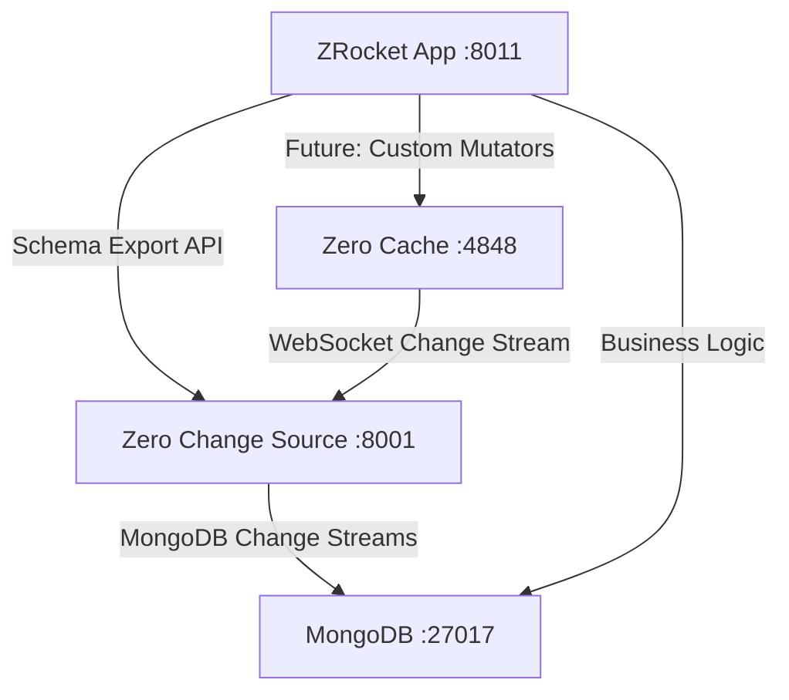

# Zero Sources - Separated Architecture

This project demonstrates a clean separation of concerns for Zero sync servers, with three independent containers that can be deployed and scaled separately.

## 🏗️ Architecture Overview



### 🎯 Three Container Architecture

1. **🚀 ZRocket NestJS + React Router SSR App** (Port: 8011)
    - Server-side rendered React frontend
    - Business logic APIs
    - **Schema Export API** (`/api/schema/*`) - provides schema configuration to source server
    - Does NOT run change source functionality

2. **🔄 Zero Change Source Server** (Port: 8001)
    - **Application-agnostic and reusable**
    - Loads schema dynamically from ZRocket or configuration files
    - WebSocket gateway for Zero change streaming
    - **Generic metadata API** (`/metadata/*`)
    - MongoDB change stream to Zero protocol conversion

3. **⚡ Zero Cache Server** (Port: 4848)
    - Independent Zero cache instance
    - Connects to Change Source via WebSocket
    - No business logic dependencies

## 🚀 Quick Start

### Option 1: Docker Compose (Recommended)

```bash
# Start all services with proper dependencies
docker-compose up -d

# Check service health
docker-compose ps
```

### Option 2: Local Development

```bash
# Windows PowerShell
.\start-all-services.ps1

# Linux/macOS
chmod +x start-all-services.sh
./start-all-services.sh
```

### Option 3: Manual Startup

```bash
# 1. Start MongoDB (if not already running)
mongod # or docker run -p 27017:27017 mongo

# 2. Start ZRocket (schema provider)
cd apps/zrocket
npm run dev

# 3. Export schema files
npm run export-schema:source-server

# 4. Start Zero Change Source
cd ../source-mongodb-server
npm run dev

# 5. Start Zero Cache
cd ../zrocket
npm run dev:zero
```

## 📊 Service URLs

| Service            | URL                            | Purpose                          |
| ------------------ | ------------------------------ | -------------------------------- |
| ZRocket App        | http://localhost:8011          | Main application + schema export |
| ZRocket API Docs   | http://localhost:8011/api-docs | OpenAPI documentation            |
| Zero Change Source | http://localhost:8001          | Change streaming + metadata      |
| Zero Cache         | http://localhost:4848          | Zero cache server                |

## 🔗 Key Endpoints

### ZRocket Schema Export API

- `GET /api/schema/export` - Export Zero schema for source server
- `GET /api/schema/table-mappings` - Export MongoDB collection mappings
- `GET /api/schema/combined` - Combined schema and mappings
- `GET /api/schema/source-server-config` - Complete source server configuration

### Source Server Metadata API

- `GET /metadata/status` - Service health and configuration status
- `GET /metadata/schemas` - Available schema configurations
- `GET /metadata/tables` - Table specifications and mappings
- `GET /health` - Health check endpoint

## ⚙️ Configuration

### ZRocket Application

```yaml
# Environment Variables
PORT: 8011
NODE_ENV: development
MONGODB_URI: mongodb://localhost:27017/zrocket
BASE_URL: http://localhost:8011
```

### Zero Change Source Server

```yaml
# apps/source-mongodb-server/config.yml
schema:
    source: url # 'file', 'url', or 'inline'
    schemaUrl: http://localhost:8011/api/schema/export
    tableMappingsUrl: http://localhost:8011/api/schema/table-mappings

db:
    uri: mongodb://localhost:27017/zrocket
    db: zrocket
    publish: [rooms, messages, participants]

auth:
    token: your-secret-token
```

### Zero Cache Server

```bash
# Connects to change source via WebSocket
ZERO_UPSTREAM_DB=ws://localhost:8001/changes/v0/stream
ZERO_PORT=4848
```

## 🔄 Schema Management

The source server is **completely application-agnostic** and loads schema configuration dynamically:

### File-Based Schema Loading

```bash
# Generate schema files for deployment
cd apps/zrocket
npm run export-schema:source-server

# Files created:
# - apps/source-mongodb-server/schemas/zrocket-schema.json
# - apps/source-mongodb-server/schemas/zrocket-table-mappings.json
```

### URL-Based Schema Loading

The source server can fetch schema from ZRocket's API endpoints in real-time, enabling dynamic schema updates without redeployment.

### Inline Schema Configuration

For simple setups, schema can be defined directly in the configuration file.

## 🏆 Benefits of This Architecture

### ✅ Separation of Concerns

- **ZRocket**: Focuses on business logic and UI
- **Change Source**: Reusable across any application with MongoDB
- **Zero Cache**: Independent scaling and deployment

### ✅ Reusability

- Source server can be used with any application that provides schema configuration
- No hard dependencies on specific application contracts
- Generic metadata API for monitoring and introspection

### ✅ Independent Scaling

- Scale change source independently based on database load
- Scale ZRocket app independently based on user traffic
- Scale Zero cache independently based on sync requirements

### ✅ Development Flexibility

- Run only the services you need during development
- Easy to test individual components
- Clear boundaries for debugging

## 🧪 Testing the Setup

```bash
# Test ZRocket schema export
curl http://localhost:8011/api/schema/export

# Test source server metadata
curl http://localhost:8001/metadata/status

# Test Zero cache health
curl http://localhost:4848/health

# Test complete change stream (requires WebSocket client)
wscat -c ws://localhost:8001/changes/v0/stream
```

## 📦 Deployment

### Development

Use the startup scripts or run services individually as shown above.

### Production

Use Docker Compose with appropriate environment variables and persistent storage for MongoDB.

### CI/CD Integration

1. Build ZRocket and export schema files
2. Deploy all three containers with proper networking
3. Ensure schema is updated when ZRocket schema changes

## 🔧 Troubleshooting

### Common Issues

1. **Services start in wrong order**: Ensure ZRocket starts first (schema provider)
2. **Schema loading fails**: Check URL connectivity between services
3. **Change streams not working**: Verify MongoDB connection and permissions

### Health Checks

Each service exposes health endpoints for monitoring and load balancer integration.

## 📋 Next Steps

The architecture separation is complete. Future enhancements could include:

- **Custom mutators**: Connect ZRocket to Zero Cache for bidirectional sync
- **Multi-tenant support**: Multiple applications sharing the same source server
- **Schema versioning**: Handle schema evolution gracefully
- **Advanced monitoring**: Metrics, tracing, and alerting
