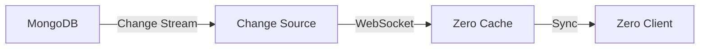

# @cbnsndwch/zero-source-mongodb

> Production-ready MongoDB change source for Rocicorp Zero with NestJS integration

[](https://www.npmjs.com/package/@cbnsndwch/zero-source-mongodb)
[](https://github.com/cbnsndwch/zero-sources/blob/main/LICENSE.md)

## Overview

`@cbnsndwch/zero-source-mongodb` is a complete, production-ready change source implementation that streams MongoDB changes to Rocicorp Zero clients. It features MongoDB change streams, discriminated union support for polymorphic collections, dynamic schema loading, WebSocket streaming, and comprehensive metadata APIs.

## Features

- 🔄 **MongoDB Change Streams**: Real-time change detection and streaming
- 🎯 **Discriminated Unions**: Map multiple Zero tables from single MongoDB collections
- 🔌 **WebSocket Gateway**: Standards-compliant Zero protocol WebSocket server
- 📊 **Dynamic Schema Loading**: File-based, URL-based, or inline schema configuration
- 🏢 **NestJS Integration**: Built with NestJS for dependency injection and modularity
- 📡 **Metadata APIs**: Health checks, status endpoints, and schema introspection
- 🔒 **Type Safety**: Full TypeScript support with strict typing
- ⚡ **Performance**: Optimized change streaming with batching and backpressure handling
- 🛡️ **Production Ready**: Error handling, logging, monitoring, and graceful shutdown

## Installation

```bash
pnpm add @cbnsndwch/zero-source-mongodb
```

**Peer Dependencies:**

```json
{
    "@nestjs/common": "^11",
    "@nestjs/config": "^4",
    "@nestjs/core": "^11",
    "@nestjs/mongoose": "^11",
    "@nestjs/platform-express": "^11",
    "@nestjs/platform-ws": "^11",
    "@nestjs/swagger": "^11",
    "@nestjs/websockets": "^11",
    "@rocicorp/zero": "0.24.2025101500",
    "mongodb": "^6.16.0",
    "mongoose": "^8.9.5",
    "ws": "^8.18.1"
}
```

## Quick Start

### 1. Basic Setup

```typescript
import { Module } from '@nestjs/common';
import { MongooseModule } from '@nestjs/mongoose';
import { ZeroMongoModule } from '@cbnsndwch/zero-source-mongodb';

@Module({
    imports: [
        MongooseModule.forRoot('mongodb://localhost:27017/mydb'),
        ZeroMongoModule.forRoot({
            schema: {
                source: 'inline',
                tables: {
                    users: {
                        columns: {
                            id: { type: 'string' },
                            name: { type: 'string' },
                            email: { type: 'string' }
                        },
                        primaryKey: ['id']
                    }
                }
            },
            collections: ['users']
        })
    ]
})
export class AppModule {}
```

### 2. Start the Server

```typescript
import { NestFactory } from '@nestjs/core';
import { AppModule } from './app.module';

async function bootstrap() {
    const app = await NestFactory.create(AppModule);
    await app.listen(8001);
    console.log('Zero change source running on http://localhost:8001');
}
bootstrap();
```

### 3. Connect Zero Client

```typescript
import { Zero } from '@rocicorp/zero';

const zero = new Zero({
    server: 'ws://localhost:8001/changes/v0/stream',
    userID: 'user-123',
    schema
});
```

## Configuration

### Dynamic Schema Loading

#### File-Based Schema

```yaml
# config.yml
schema:
    source: file
    schemaFile: ./schemas/my-schema.json
    tableMappingsFile: ./schemas/table-mappings.json

db:
    uri: mongodb://localhost:27017/mydb
    db: mydb
    publish: [users, posts, comments]
```

#### URL-Based Schema

```yaml
schema:
    source: url
    schemaUrl: http://api.example.com/api/schema/export
    tableMappingsUrl: http://api.example.com/api/schema/table-mappings

db:
    uri: mongodb://localhost:27017/mydb
    db: mydb
    publish: [users, posts, comments]
```

#### Inline Schema

```typescript
ZeroMongoModule.forRoot({
    schema: {
        source: 'inline',
        tables: {
            // Define tables directly
        }
    }
});
```

## Discriminated Unions

Map multiple Zero tables from a single MongoDB collection based on a discriminator field:

```typescript
// MongoDB: Single 'rooms' collection with type field
const tableMappings = {
    chats: {
        collection: 'rooms',
        discriminator: { field: 'type', value: 'chat' }
    },
    channels: {
        collection: 'rooms',
        discriminator: { field: 'type', value: 'channel' }
    },
    groups: {
        collection: 'rooms',
        discriminator: { field: 'type', value: 'group' }
    }
};

// Result: Three Zero tables from one MongoDB collection
// - chats (rooms where type='chat')
// - channels (rooms where type='channel')
// - groups (rooms where type='group')
```

## API Endpoints

### WebSocket

- **`ws://localhost:8001/changes/v0/stream`** - Zero change stream

### REST Endpoints

- **`GET /metadata/status`** - Service health and configuration status
- **`GET /metadata/schemas`** - Available schema configurations
- **`GET /metadata/tables`** - Table specifications and mappings
- **`GET /health`** - Simple health check

### Example Status Response

```json
{
    "status": "healthy",
    "schemaSource": "url",
    "schemaLoaded": true,
    "tablesCount": 5,
    "collectionsWatched": ["rooms", "messages", "users"],
    "uptime": 3600
}
```

## Advanced Usage

### Custom Change Processing

```typescript
import { ChangeProcessor } from '@cbnsndwch/zero-source-mongodb';

@Injectable()
export class MyChangeProcessor extends ChangeProcessor {
    async processChange(change: ChangeStreamDocument): Promise<void> {
        // Custom change processing logic
        console.log('Processing change:', change.operationType);
        await super.processChange(change);
    }
}
```

### Filtering Changes

```typescript
ZeroMongoModule.forRoot({
    // ... other config
    changeFilter: change => {
        // Only stream certain operations
        return ['insert', 'update', 'delete'].includes(change.operationType);
    }
});
```

### Custom Authentication

```typescript
import { CanActivate, ExecutionContext } from '@nestjs/common';

@Injectable()
export class ZeroAuthGuard implements CanActivate {
    canActivate(context: ExecutionContext): boolean {
        const request = context.switchToWs().getClient();
        const token = request.handshake.auth.token;
        return this.validateToken(token);
    }
}
```

## Architecture

### Three-Container Architecture

This change source is designed to work in a distributed three-container architecture:

1. **Application Server** (e.g., NestJS app) - Exports schema configuration
2. **Zero Change Source** (this package) - Streams MongoDB changes
3. **Zero Cache Server** - Caches data for clients

See [Architecture Documentation](https://github.com/cbnsndwch/zero-sources/blob/main/docs/refactor/README-SEPARATED-ARCHITECTURE.md) for details.

### Change Stream Flow



## Production Deployment

### Docker

```dockerfile
FROM node:22-alpine
WORKDIR /app
COPY package.json pnpm-lock.yaml ./
RUN npm install -g pnpm && pnpm install --frozen-lockfile
COPY . .
RUN pnpm build
EXPOSE 8001
CMD ["node", "dist/main.js"]
```

### Docker Compose

```yaml
services:
    change-source:
        image: my-change-source:latest
        ports:
            - '8001:8001'
        environment:
            - MONGODB_URI=mongodb://mongo:27017/mydb
            - SCHEMA_URL=http://api:8011/api/schema/export
        depends_on:
            - mongo
            - api
```

## Monitoring

### Health Checks

```bash
# Check service health
curl http://localhost:8001/health

# Detailed status
curl http://localhost:8001/metadata/status
```

### Logging

The change source provides structured logging:

```typescript
// Automatic logging of:
// - Connection events
// - Schema loading
// - Change stream events
// - Errors and warnings
```

## Troubleshooting

### Common Issues

**Schema Not Loading:**

```bash
# Check schema URL accessibility
curl http://api:8011/api/schema/export

# Verify configuration
curl http://localhost:8001/metadata/status
```

**Change Stream Not Working:**

- Ensure MongoDB replica set is configured
- Check MongoDB connection string
- Verify collection names in configuration

**WebSocket Connection Failed:**

- Check firewall rules
- Verify WebSocket endpoint URL
- Check client authentication

## Development

```bash
# Install dependencies
pnpm install

# Build the package
pnpm build

# Run in development mode
pnpm dev

# Run tests
pnpm test

# Lint code
pnpm lint
```

## Examples

See the [source-mongodb-server app](https://github.com/cbnsndwch/zero-sources/tree/main/apps/source-mongodb-server) for a complete working example.

## Contributing

Contributions are welcome! Please see the [main repository](https://github.com/cbnsndwch/zero-sources) for contribution guidelines.

## License

MIT © [cbnsndwch LLC](https://cbnsndwch.io)

## Related Packages

- [@cbnsndwch/zero-contracts](https://www.npmjs.com/package/@cbnsndwch/zero-contracts) - Core contracts and utilities
- [@cbnsndwch/zero-nest-mongoose](https://www.npmjs.com/package/@cbnsndwch/zero-nest-mongoose) - Schema generation from Mongoose
- [@cbnsndwch/zero-watermark-zqlite](https://www.npmjs.com/package/@cbnsndwch/zero-watermark-zqlite) - SQLite watermark storage
- [@cbnsndwch/zrocket-contracts](https://www.npmjs.com/package/@cbnsndwch/zrocket-contracts) - Example application contracts

## Resources

- [Rocicorp Zero Documentation](https://zero.rocicorp.dev/)
- [MongoDB Change Streams](https://www.mongodb.com/docs/manual/changeStreams/)
- [Architecture Guide](https://github.com/cbnsndwch/zero-sources/blob/main/docs/refactor/README-SEPARATED-ARCHITECTURE.md)
- [Change Source Protocol](https://github.com/cbnsndwch/zero-sources/blob/main/docs/ChangeSourceProtocol.md)
